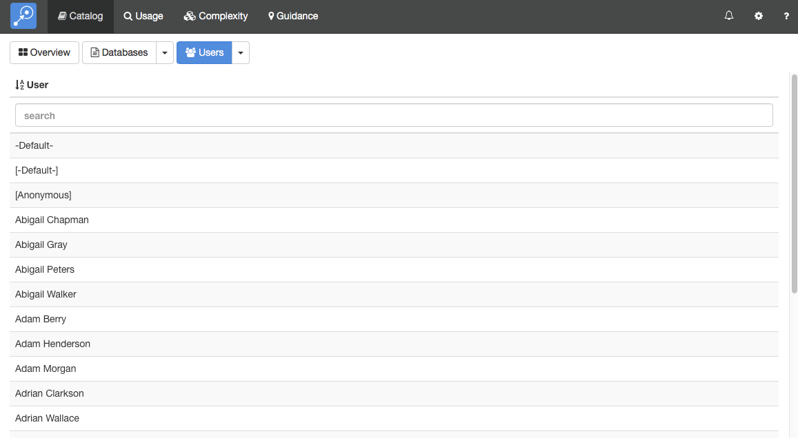
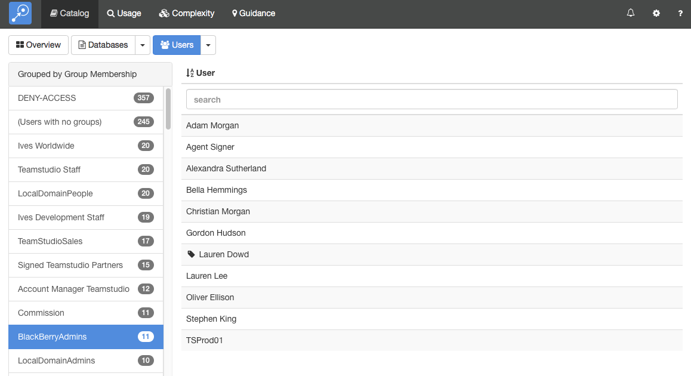

# カタログ

この 「カタログ」モジュールでは、Domino サーバーのカタログから情報を読み込みます。サーバー上のデータベースおよびテンプレートすべてのマスターリストとして提供されます。また、Teamstudio Adviser の他のモジュールが参照するマスター情報にもなります。

## カタログ・スキャンを実行する
設定 ページのサーバー セクションで カタログ・スキャンを実行します。詳細はこちらの関連する[ヘルプ](settings_servers.md)をご参照ください。

## カタログを表示する
カタログ・スキャンの実行後には、上部ナビゲーションバーの「カタログ」をクリックするか、Adviser ホームページの「カタログ」セクションをクリックして結果を表示し確認できます。ここではまず最初に「カタログ」の概要ページを表示します。
<figure markdown="1">
  
</figure>
概要ページでは、ファイルサイズの大きいデータベースと、設計要素の数が多いテンプレートを表示します。それぞれのチャートにあるボタンで、パイチャート、棒グラフ、表での表示の切り替えが行えます。このページでは、直近のスキャンのサマリーを表示しているので、スキャンしたデータがどれくらい最新かを確認できます。データを最新にしたければカタログ・スキャンでいつでも実行できます。

## データベースの表示
データベースの一覧を表示するには、画面上部の「データベース」ボタンをクリックします。
<figure markdown="1">
  
</figure>

デフォルトでは、すべてのサーバー上の全データベースの一覧を表示します。Teamstudio Adviser 内のどのリストにも共通して、列ヘッダーをクリックすることでデータをソートできます。また、検索ボックスを使って検索テキストに合致したデータベースを表示できます。すべての列が検索され、例えばテンプレート名だけでなくデータベースパスも検索対象となります。

完全なリストを表示する代わりに、いろんな方法でデータベースをグループ分けできます。画面上部の「データベース」ボタンの右にある下矢印をクリックします。テンプレート別、最終更新日別などのデータをグループ化できる方法を提供しています。例えば、テンプレートでグループ分けしたい場合、下のような画面が表示されます。
<figure markdown="1">
  
</figure>

左側にテンプレートのリストが表示され、そのテンプレートが使用されていますデータベースの数も確認できます。テンプレートを選択すると、該当するデータベースが表示されます。

## データベースの詳細を表示する
ひとつのデータベースに対して、カタログの詳細を表示するには、単純にリストからそのデータベースを選択します。これで、詳細画面が表示されます。
<figure markdown="1">
  
</figure>

この画面では、左にデータベースのリストを表示し、右に選択データベースの詳細を表示します。そのデータベースに関する異なるタイプのデータを展開し表示することができます。Teamstudio Adviser はどのセクションを展開したかを記憶しているので、アプリケーション間を移動しても同じセクションの状態で詳細を表示します。

詳細情報上部のボタン群列を使って他のモジュールが収集した詳細情報を確認できます:
<figure markdown="1">
  
</figure>

このボタンで「カタログ」、「利用状況」、「複雑さ」、「ガイダンス」の各詳細に切り替わります。最後のボタンはデータベースをフィルターするのに使用されます。詳しくは[フィルタ](filters.md)ー をご参照ください。

表示していたものグループ分けされていたリストであった場合は、スクリーンの上部左側に追加のコントールが表示され、グループ間を切り替えルことできます。このボタンには左矢印と右矢印のコントロールがあり、前や次のグループに移動できます。そのグループ名のある中央のテキストをクリックして、グループすべてを表示してドロップダウンリストから選択することもできます。

### 有効アクセス権
Adviser 6.1 よりそれぞれのデータベースに新しい詳細セクションが追加されました。: 有効アクセス権 - ユーザー です。この情報はグループ設定を展開した ACL 設定として、ユーザーがこのデータベースに対してどのアクセスが付与されているかを正確に把握できます。
<figure markdown="1">
  
</figure>
有効アクセス権は ACL に設定されているエントリに実際の名前がリストされている場合には通常の文字列を、グループの中設定されているそのユーザーのアクセスには斜体の文字で表現しています。上のサンプルでは、Gordon Hudson はACL でその名前が管理者として設定されていますが、Christian Morgan は管理者と斜体で表示されているので、ACLに直接指定されておらず、グループ設定の中のメンバーとしてアクセスが与えられていることがわかります。あるユーザーをクリックして、このユーザーのグループでのメンバーを調べたり、このユーザーが他のデータベースに対してどのようなアクセスができるかを調査できるできる対応するユーザー詳細の画面を表示させることができます。比較の参考までに、こちらは同じデータベースの ACL 設定です。
<figure markdown="1">
  
</figure>
あるデータベースへのアクセスに関わるすべてのユーザーのリストは、非常に膨大なものになりがちで、Adviser では一度に表示するユーザーの数を 10 名を上限として分けて表示しています。最初や最後のボタン、あるいは矢印のボタンを使ってページ間を移動できます。あるいは特定のユーザーがわかっている場合には、リスト内のすべてから検索バーを使って、それに合致したユーザーを表示させることもできます。Adviser の共通した機能として、列ヘッダーをクリックしユーザー名やアクセス権でソートをかけることもできます。

!!! note
    有効アクセス権の分析は大規模な組織において非常に大量のデータを生成します。よって、 Adviser 6.5 以降ではデフォルトで無効となっています。詳細は[リリースノート](release.md)を参照してください。
    
!!! note
    有効アクセス権は ACL にリストされてい直接指定されているるユーザー、あるいはグループで間接的に指定されているユーザーのみを表示します。しかし、*Default* のACL エントリでアクセスするユーザーに関しては表示されません。
    
### ビジネス・バリュー
詳細ビューの上部にはダイアモンドアイコンのドロップダウンリストがあります。
<figure markdown="1">
  
</figure>
このドロップダウンリストで、データベースに対して組織での重要性を表す「ビジネス・バリュー」を設定できます。 この値には、1 から 5 までの値をセットでき、1 はまったく重要ではない、5 はクリティカルで重要であることを意味します。ビジネス・バリューはサーバーを統合したりアプリケーションを移行するなど、そのデータベースの将来を決定する上で重要な要因となります。加えて、Adviser の「ガイダンス」による提案において重要なコンポーネントでもあります。

### キーボード操作
詳細ビューの操作を容易にするいくつかのキーボードショートカットを用意しています。

* 上または下矢印でリスト内のデータベースを前や次に移動できます
* 左または右矢印で、異なるモジュールへ切り替えることができます
* 0 から 5 の数字キーで、該当データベースにビジネス・バリューを設定できます。1 から 5 を使用するか、0 で値を「不明」に戻すことができます。

### 削除されたデータベース
Adviser 6.6 以降ではデータベースが削除されたものとしてサーバー上の catalog.nsf で検知されなくなったデータベースをマークし、削除シンボルで表し表示しています:  
<figure markdown="1">
  
</figure>  
!!! note
    削除ステータスは catalog.nsf 内の文書によって決定されます。Adviser のカタログスキャンの前にステータスを最新のものにするため必ずサーバーの「カタログ」タスクが起動していることが必要です。
    
削除されたデータベースに対するp[フィルターオプション](filters.md)で削除されたすべてのデータベースをフィルターにかけ表示しないようにすることもできます。

サーバー上に新しいデータベースが作成された場合、通常夜中に起動する「カタログ」タスクが実行されるまで catalog.nsf には記録されません。Adviser のスキャンによってその新規データベースに対する利用状況データがあった場合には、そのデータベースのエントリーを作成しますが、カタログ内に見つからないので削除されたデータベースとしてマークします。こういったデータベースは次のようなメッセージとして現れます:
<figure markdown="1">
  
</figure>
Adviser の継続したスキャンにより catalog.nsf に新規データベースが現れるようになると、削除のステータスとこのメッセージは無くなります。さらに Adviser がサーバーに対してスキャンを行う最初のタイミングでもうすでのそのデータベースが削除されていても利用状況のデータが存在する場合には、このメッセージが表示されルことになります。Adviser がこれまでに一度でも検知したことがあるデータベースでカタログに載ったものに関してはこのメッセージは表示されません。

## ユーザーの表示
ユーザーのリストを表示するには、カタログの概要画面に戻り、ユーザーボタンをクリックします。
<figure markdown="1">
  
</figure>

デフォルトでは、スキャンしたアドレス帳内のすべてのユーザーのリストを表示します。完全リストを表示するかわりに、様々な方法でユーザーを分類できます。画面上部のユーザーボタンの右にある下矢印をクリックします。これを使ってデータを様々な方法で表示させることができ、例えば、グループ毎に表示したい場合には、次のような画面になります。
<figure markdown="1">
  
</figure>

左には、アドレス帳に登録されたグループの一覧が、それぞれに所属するユーザーの数とともに表示されます。グループを選択すると、そのユーザーが表示されます。Adviser は自動的にすべてのネストしたグループを展開するので、このユーザーのリストはグループで明示的に指定したユーザーだけでなく、ネストするグループ内のユーザーも表示されます。

## ユーザー詳細の表示
ユーザーに対するカタログの詳細を表示するには、どのリストからでも構いませんがユーザーを選択してください。詳細の画面が表示されます。
<figure markdown="1">
  
</figure>
この画面では、左にユーザーの一覧、右に選択したそのユーザーの詳細を表示します。セクションを選択するとこのユーザーに関する異なるタイプのデータを表示できます。Teamstudio Adviser は展開したセクションの状態を記憶していますので、アプリケーション内の他の箇所へ移動しても常に同じビューを表示するようになっています。

### グループのメンバーを理解する
あるユーザーに対するグループセクションは、そのユーザーが所属するすべてのグループのリストを表示します。ユーザーがグループ内で明示的に設定されている場合には標準の文字列で、別のグループに所属のあるグループで設定されている場合には斜体の文字で表示されます。例えば上のスクリーンでは  Lauren Dowd は JP Admin グループに明示的に設定されて、"JP Admin" は標準の文字列で表示されていますが、*Administrators* グループに所属し間接的に設定されているため斜体で表示されています。2番目の列「経由」では、この *Administrators* グループが JP Admin グループに含まれていることを説明しています。同様に、次の *Groupshield Administrators* グループに所属しており、Administrators グループに含まれていることを示しています。

このユーザーが明示的に指定されているグループを確認したい場合には、上部にあるグループの表示指定ボタンをクリックし「すべて」から「明示情報のみ」にスイッチします。

!!! note
    グループのデータは有効アクセス権分析が有効時のみ利用できます。さらなる詳細は[リリースノート](release.md)を参照してください。
    
### 有効アクセス権
グループ内のメンバーに加え、Adviser では直接またはグループ経由でこのユーザーが ACL で指定されているすべてのデータベースを表示します。有効アクセス権 - データベースセクションで確認できます。
<figure markdown="1">
  
</figure>
このユーザーがデータベースに設定されているアクセスレベルは、そのユーザーが明示的に ACL で設定されている場合には標準の文字列で、グループを経由した設定の場合には斜体で表示されます。上の例では、SalesTraining/SalesEngineerTest.nsf は管理者として ACL に直接指定されていますが、同時にこのユーザーはグループによる設定から mailarchive/a_apeter.nsf は管理者の権限をもっていますが、ACL の中には明示的に設定されていません。そのデータベースの名前をクリックして、そのデータベースの ACL 情報や他のユーザーのアクセスを確認できます。

!!! note
   有効アクセス権分析は、大きな組織では非常に大量のデータを生成することになります。それ故に、Adviser 6.5 以降ではデフォルトでは無効になっています。より詳細の情報は[リリースノート](release.md)を参照してください。
    
!!! note
    有効アクセス権は ACL にリストされてい直接指定されているるユーザー、あるいはグループで間接的に指定されているユーザーのみを表示します。しかし、Default のACL エントリでアクセスするユーザーに関しては表示されません。
    