# Catalog

The Catalog module imports information from Domino server catalogs and address books. It serves as a master list of all databases, templates, users and groups on your servers and all of the other modules in Teamstudio Adviser refer to it.

## Running a Catalog Scan
You run a Catalog Scan from the *Servers* section of the *Settings* page. See the relevant [documentation](settings_servers.md) for details.

## Viewing the Catalog
After you have run a Catalog Scan, you can view the results by clicking on Catalog on the top navigation bar or by clicking on the Catalog section of the Adviser home page. This will display the Catalog overview page.
<figure markdown="1">
  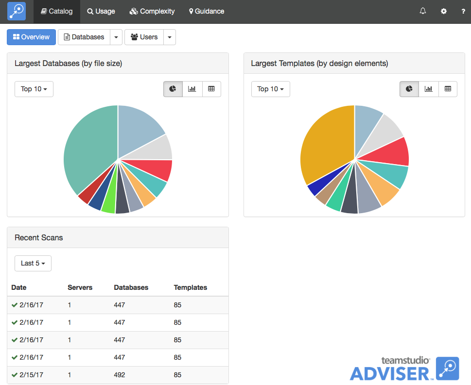
</figure>
The overview page shows the largest databases by file size and the largest templates by number of design elements. You can use the buttons next to each chart to control whether the data is shown as a pie chart, a bar chart or a table. The page also shows a summary of the last few scans so that you can see how current your scan data is. You can run a Catalog Scan any time you want to update the data.

## Viewing Databases
To view a list of databases, click the *Databases* button at the top of the screen.
<figure markdown="1">
  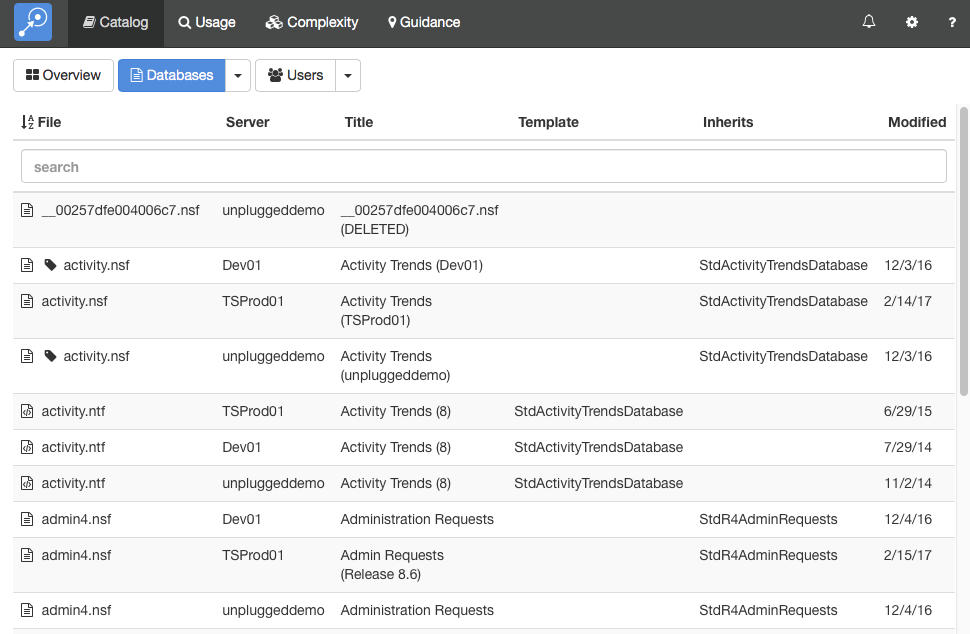
</figure>

By default, this will display a list of all of the databases on all your servers. As with any list in Teamstudio Adviser, you can click on any of the column headers to sort the data. You can also use the search box to limit the display to databases matching the search text. All of the columns are searched, so you can, for example, match on a template name, not just a database path.

Instead of viewing a complete list, you can group the databases in various ways. To do this, click on the down arrow at the right of the *Databases* button at the top of the screen. This will offer several ways to group the data, such as by template or by date of last modification. For example, if you group by template, you will see a screen like the following.
<figure markdown="1">
  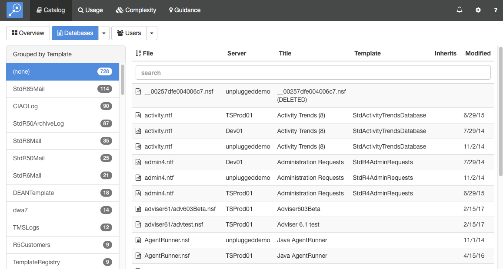
</figure>

To the left, a list of templates is shown, along with how many databases use that template. Selecting a template will display a list of those databases.

## Viewing Database Details
To view the catalog details for a database, simply select the database from any list. This will display the details screen.
<figure markdown="1">
  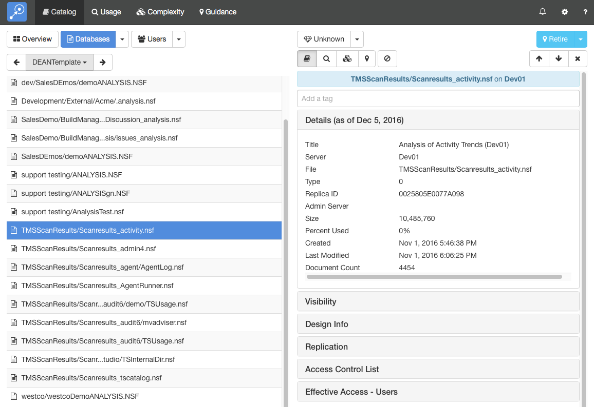
</figure>

This screen shows the database list on the left and the details of the selected database on the right. You can expand the sections to view different types of data about the database. Teamstudio Adviser will remember which section you have expanded so that you will see a consistent view as you navigate through the application.

You can view details from other modules using the row of buttons above the details.
<figure markdown="1">
  
</figure>

These will switch between Catalog, Usage, Complexity and Guidance details. The last button is used to filter the database - see [Filters](filters.md) for details.

If the list that you were viewing was grouped then you will see an additional control at the top left of the screen that allows you to navigate through the groups. This control has buttons with left and right arrows that allow you to navigate to the previous and next groups. You can also click on the central text with the group name to select from a dropdown list of all groups.

### Effective Access
Adviser 6.1 adds a new detail section for databases: *Effective Access - Users*. You can think of this as being a version of the ACL with all of the groups expanded so that you can see exactly which users have been granted access to the database.
<figure markdown="1">
  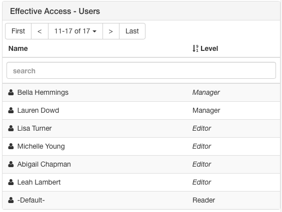
</figure>
Effective Access uses standard text to identify users that are explicitly listed in the ACL and *italics* to identify users that have access to the database via a group. In the example above, Lauren Dowd is explicitly listed in the ACL as a manager. Bella Hemmings is also a manager, but because Manager is displayed in italics, she is not explicitly listed in the ACL with that access level. You can click on a user to navigate to the corresponding user details screen to explore group membership for the user or find out which other databases they can access. For comparison, here is the ACL for the same database.
<figure markdown="1">
  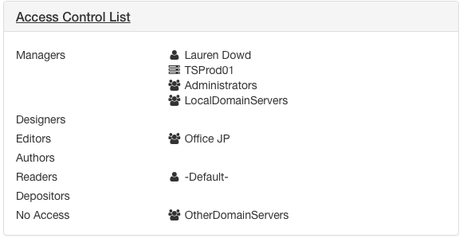
</figure>
The full list of users with access to a database can grow large and so Adviser breaks the list into pages of up to ten users at a time. You can use the First, Last and arrow buttons to navigate through the pages. Alternatively, the search bar will search the entire list and only display matching users. As always in Adviser, you can also click on the column headers to sort the list by user name or access level.

!!! note
    Effective Access can generate very large volumes of data in large organizations and is
    therefore disabled by default from Adviser 6.5 onwards. See the [Release Notes](release.md)
    for more details.
    
!!! note
    Effective Access only lists users named in the ACL, either directly or indirectly via a group. It will not list users that, for example, have access to a database via a *Default* ACL entry.
    
### Business Value
At the top of the details view, you will see a dropdown with a diamond icon.
<figure markdown="1">
  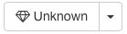
</figure>
This allows you to set a Business Value for a database representing its importance to your organization. The value is set on a scale of 1 to 5 with 1 meaning not important and 5 meaning critically important. Business value is an important factor when determining the future of a database as you consolidate servers or migrate your applications and it is a key component in Adviser's guidance recommendations.

### Keyboard Navigation
There are several keyboard shortcuts to help you navigate around the details view.

* Up and Down arrows will move to the previous and next databases in the list.
* Left and Right arrows will cycle through the different modules.
* 0-5 will set the business value for the database. Use 1-5 to set the value or 0 to revert to Unknown.

### Deleted Databases
Adviser 6.6 and later marks databases that are no longer found in a server's catalog.nsf as deleted, displaying them with a trashcan icon.
<figure markdown="1">
  
</figure>  
!!! note
    Deleted status is determined by the documents in catalog.nsf. The server's *catalog* task must
    run prior to Adviser's catalog scan for status to update.
    
You can use [Filters](filters.md) to hide deleted databases from the Adviser UI.

When new databases are created on a server, they do not appear in the server's catalog.nsf until the *catalog* task has run, normally at night.  If an Adviser scan is run and there are new databases found in the usage data scanned, Adviser will create an entry for the database, but will mark it as deleted since it was not found in the catalog.  These databases will also contain a message to this effect.
<figure markdown="1">
  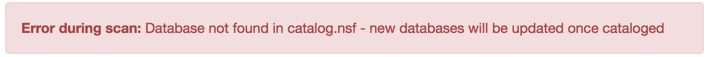
</figure>
Once these databases appear in the catalog.nsf in a subsequent Adviser scan, the deleted status and the message will be removed. Databases that were deleted prior to the first time a server was scanned, but that were found in usage during the initial scan, will also display this message.  Databases that Adviser knows were in the catalog at some point in time will not show this message.

## Viewing Users
To view a list of users, return to the Catalog overview screen and click the *Users* button.
<figure markdown="1">
  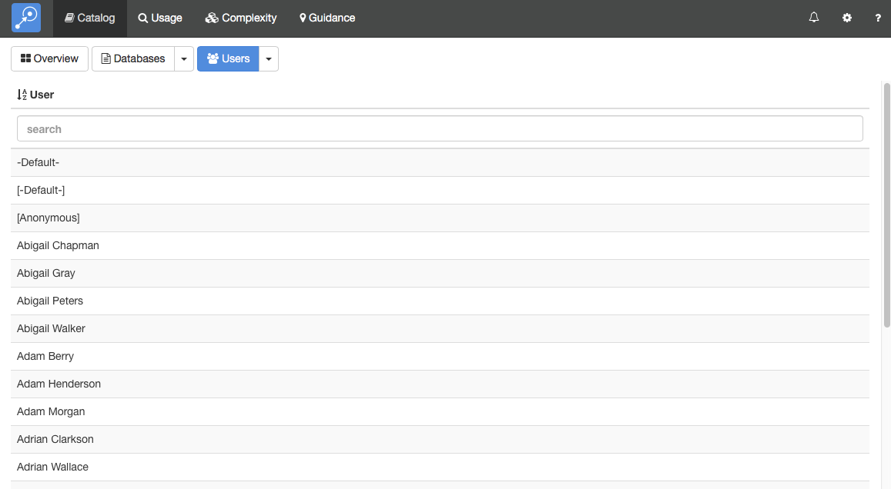
</figure>

By default, this will display a list of all of the users in all scanned address books. Instead of viewing a complete list, you can group the users in various ways. To do this, click on the down arrow at the right of the Users button at the top of the screen. This will offer several ways to group the data. For example, if you group by Group Membership, you will see a screen like the following.
<figure markdown="1">
  
</figure>

To the left, a list of address book groups is shown, along with the number of users in each group. Selecting a group will display those users. Note that Adviser automatically expand out all nested groups and so the list of users includes not only users explicitly named in the group but also users contained in any nested groups.

## Viewing User Details
To view the catalog details for a user, simply select the user from any list. This will display the details screen.
<figure markdown="1">
  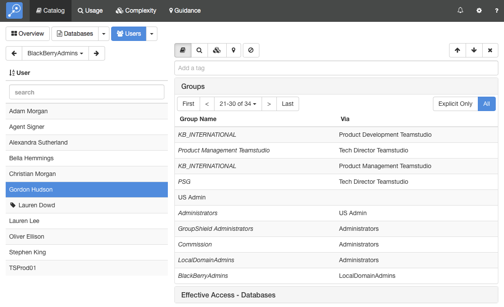
</figure>
This screen shows the user list on the left and the details of the selected user on the right. You can expand the sections to view different types of data about the user. Teamstudio Adviser will remember which section you have expanded so that you will see a consistent view as you navigate through the application.

### Understanding Group Membership
The *Groups* section for a user shows all of groups that a user belongs to. If a user is explicitly named in a group then the group name will be shown in standard text. If a user is indirectly in a group as a result of belonging to another group then the group name will be shown in *italics*. For example, in the screen above, Gordon Hudson is explicitly named in the US Admin group because 'US Admin' is displayed in  standard text. On the line underneath, he is shown as indirectly belonging to the Administrators group because Administrators is displayed in italics. The second column, titled 'Via' explains why: the Administrators group contains the US Admin group. Similarly, on the next line, he is in the Groupshield Administrators group because that contains the Administrators group.

If you only want to see the groups that explicitly contain the user then you can use the toggle at the top of the section to switch from All groups to Explicit Only groups.

!!! note
    Group data will only be available if Effective Access is enabled. Please see the [Release Notes](release.md) for further details.
    
### Effective Access
In addition to group membership, Adviser shows you all databases that list a user in the ACL either directly or via a group. This is in the *Effective Access - Databases* section.
<figure markdown="1">
  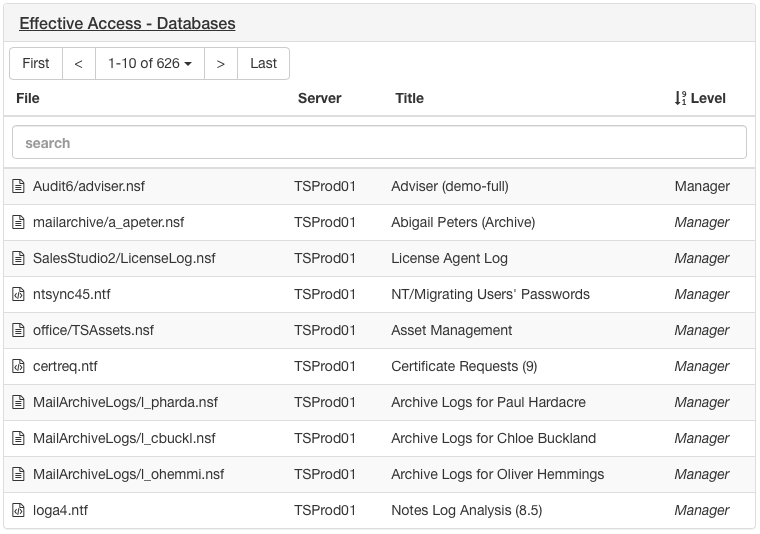
</figure>
The access level that the user has to the database is show in regular text if the user is explicitly listed in the ACL and in *italics* if the access is via a group. So in the example above, the user is listed in the ACL for Audit6/adviser.nsf as a Manager. The user also has manager access to mailarchive/a_apeter.nsf although they are not explicitly listed as such in the ACL. You can click on a database name to navigate to that database to explore the ACL or find out which other users have access to that database.

!!! note
    Effective Access can generate very large volumes of data in large organizations and is
    therefore disabled by default from Adviser 6.5 onwards. See the [Release Notes](release.md)
    for more details.
    
!!! note
    Effective Access only lists databases that contain the user in the ACL, either directly or
    via a group. It does not list databases that the user has access to, for example, via a
    *Default* ACL entry.
    