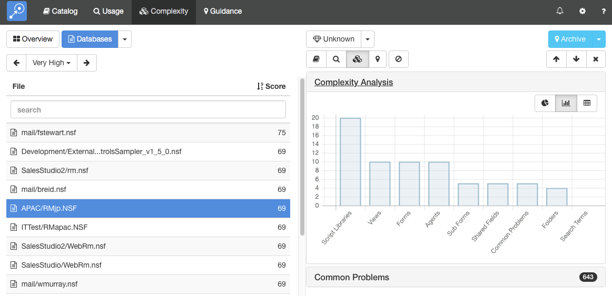

# 複雑さ

この「複雑さ」モジュールは Notes アプリケーションをメンテナンス継続するか、移行するかに関わる作業の大変さを示します。このモジュールは、複雑さのスコアを計算するうえで、異なるタイプの設計要素の数や移行が難しい要素の存在、ユーザー手以後のキーワード類など、多くの異なる要因から組み合わされています。スコアは「非常に低い」から「非常に高い」までの 5 点評価でランク付けされます。

## 複雑さスキャンの実行
有効時には、Teamstudio Adviser はカタログスキャンのあとに自動的に複雑さスキャンを実行します。以降のスキャンは最後のスキャンから設計に変更があったデータベースのみスキャンを実行します。

!!! note
    複雑さのスキャンは、大規模な環境において完全スキャンに何時間もかかるため、初期状態では無効になっています。また複雑さスキャンを実施する前に、キーワードを完成させておくことをお勧めします。キーワードを変更した場合には、もう一度完全スキャンを実行しますのでご注意ください。

## 複雑さの表示
複雑さスキャンの実行後には、上部ナビゲーションバーの「複雑さ」クリックするか、Adviser ホームページの「複雑さ」セクションをクリックして結果を表示し確認できます。ここではまず最初に「複雑さ」の概要ページを表示します。

<figure markdown="1">
  
</figure>
概要ページでは、複雑さのランクで分類されたデータベース群と複雑さのタイプを表示し(例 スクリプトライブラリー、キーワード)、環境全体に対して何がもっとも複雑かを知ることができます。
データベースの一覧を表示するには、画面上部の「データベース」ボタンをクリックします。
<figure markdown="1">
  
</figure>
デフォルトでは、すべてのサーバー上の全データベースの一覧を表示します。Teamstudio Adviser 内のどのリストにも共通して、列ヘッダーをクリックすることでデータをソートできます。また、検索ボックスを使って検索テキストに合致したデータベースを表示できます。すべての列が検索され、例えばテンプレート名だけでなくデータベースパスも検索対象となります。

完全なリストを表示する代わりに、いろんな方法でデータベースをグループ分けできます。画面上部の「データベース」ボタンの右にある下矢印をクリックします。テンプレート別、最終更新日別などのデータをグループ化できる方法を提供しています。例えば、テンプレートでグループ分けしたい場合、下のような画面が表示されます。
<figure markdown="1">
  
</figure>
左側に複雑さランクのリストが表示され、ランク付けされたそれぞれのデータベースの数も確認できます。ランクを選択すると、該当するデータベースが表示されます。

!!! note
    複雑さランクが n/a となるデータベースがあるかもしれません。これはデータベースを分析するうえで Adviser がアクセスできなかった時に発生します。一般的な理由として、複雑さスキャンを実行するワークステーションにデータベースを開く充分な権限がないか、該当するデータベースが削除されているために起こります。
    
## データベース詳細の表示
データベースに対する複雑さの詳細を表示するには、単純にリストからそのデータベースを選択します。これで、詳細画面が表示されます。
<figure markdown="1">
  
</figure>
この画面では、左にデータベースのリストを表示し、右に選択データベースの詳細を表示します。そのデータベースに関する異なるタイプのデータを展開し表示することができます。Teamstudio Adviser はどのセクションを展開したかを記憶しているので、アプリケーション間を移動しても同じセクションの状態で詳細を表示します。

### 複雑さ分析
この複雑さ分析セクションでは、Adviser が複雑さスコアの計算方法を表示します。上記のサンプルでは、このデータベースは複雑さスコア 69 で、非常に高いとしてランクされています。Adviser がランクへとスコアを計算するのに使用する閾値は弊社が長年多くのお客様とのやりとりの中で設定されていますのです。しかしながら、それぞれの企業の状況に合わせて閾値を変更することも可能です。この設定に関する詳細は 設定 の 複雑さセクションを参照してください。

この 複雑さスコアは、それぞれの複雑さのタイプに対して割り当て計算し(例 スクリプトライブラリーの存在)、スコアを合算しています。上の棒グラフを見ていただくと、スクリプトライブラリー のスコアが 20、フォルダーが 4 になっています。スコアすべての合計がこのチャートでは 69 となっています。

### よくある問題
<figure markdown="1">
  
</figure>

このよくある問題セクションでは、データベース内にあるよくある問題を表示します。これには、問題に該当する設計要素の数がカウントされています。これらの問題は他の開発環境内で再作成するのが難しい Domino の機能を表しています。デフォルトの設定をご使用いただくのを推奨しますが、設定 ページの複雑さセクションでご自身でこの問題を設定することもできます。詳細についてはこちらの関連する[文書](settings_complexity.md)を参照してください。この設定を変更しても複雑さは常にこの問題すべてに対してカウントの収集をするので、新たにスキャンを実行する必要はありません。

詳細情報上部のボタン群列を使って他のモジュールが収集した詳細情報を確認できます:
<figure markdown="1">
  
</figure>

このボタンで「カタログ」、「利用状況」、「複雑さ」、「ガイダンス」の各詳細に切り替わります。最後のボタンはデータベースをフィルターするのに使用されます。詳しくは[Filters](filters.md)をご参照ください。

表示していたものグループ分けされていたリストであった場合は、スクリーンの上部左側に追加のコントールが表示され、グループ間を切り替えルことできます。このボタンには左矢印と右矢印のコントロールがあり、前や次のグループに移動できます。そのグループ名のある中央のテキストをクリックして、グループすべてを表示してドロップダウンリストから選択することもできます。

## キーボード操作
詳細ビューの操作を容易にするいくつかのキーボードショートカットを用意しています。

* 上または下矢印でリスト内のデータベースを前や次に移動できます
* 左または右矢印で、異なるモジュールへ切り替えることができます