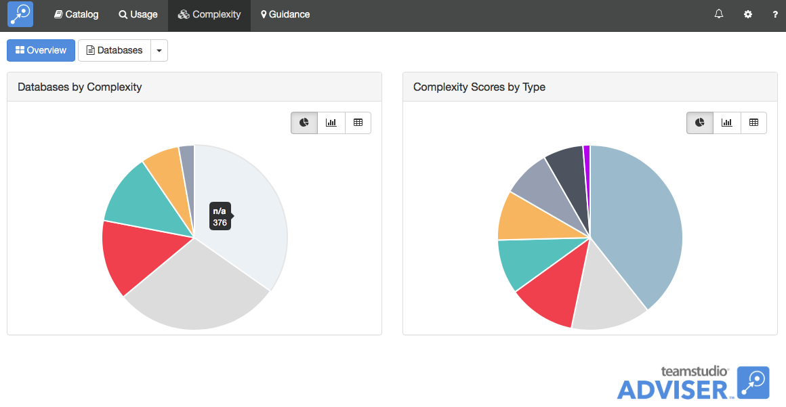

# Complexity

The Complexity module gives you an indication of the effort that would be involved in maintaining or migrating a Notes application. The module combines a number of different factors such as the number of design elements of different types, the presence of certain hard-to-migrate elements and the presence of user-definable keywords to compute a complexity score. That score is then converted to a five-point complexity ranking from Very Low to Very High.

## Running a Complexity Scan
If enabled, Teamstudio Adviser will automatically run a complexity scan after running a catalog scan. Subsequent scans will only analyze databases whose design has changed since the last scan.

!!! note
    Complexity scanning is initially disabled as a full complexity scan may take many days in a large environment. We recommend making sure that your keywords have been fully configured before enabling complexity scanning since changing the keywords will require another full scan.

## Viewing Complexity
After you have run a Complexity Scan, you can view the results by clicking on Complexity on the top navigation bar or by clicking on the Complexity section of the Adviser home page. This will display the Complexity overview page.
<figure markdown="1">
  
</figure>
The overview page shows databases categorized by the complexity ranking and an indication of which types of complexity (e.g. script libraries, keywords) are contributing most to your overall environment.
To view a list of databases, click the *Databases* button at the top of the screen. 
<figure markdown="1">
  
</figure>
By default, this will display a list of all of the databases on all your servers. As with any list in Teamstudio Adviser, you can click on any of the column headers to sort the data. You can also use the search box to limit the display to databases matching the search text. All of the columns are searched, so you can, for example, match on a database title, not just a database path.

Instead of viewing a complete list, you can group the databases in various ways. To do this, click on the down arrow at the right of the *Databases* button at the top of the screen. This will offer several ways to group the data, such as by template or by complexity. For example, if you group by complexity, you will see a screen like the following.
<figure markdown="1">
  
</figure>
To the left, a list of complexity ranks is shown, along with how many databases have that ranking. Selecting a ranking will display a list of those databases.

!!! note
    Some databases have a complexity ranking of n/a. This occurs when Adviser cannot access the
    database to analyze it. Common reasons for this are that the workstation running the complexity
    scan may not have sufficient permissions to open the database or the database may have been deleted.
    
## Viewing Database Details
To view the complexity details for a database, simply select the database from any list. This will display the details screen.
<figure markdown="1">
  
</figure>
This screen shows the database list on the left and the details of the selected database on the right. You can expand the sections to view different types of data about the database. Teamstudio Adviser will remember which section you have expanded so that you will see a consistent view as you navigate through the application.

### Complexity Analysis
The *Complexity Analysis* section shows how Adviser computed the complexity score. In the example above, the database has a complexity score of 69 which is ranked as *Very High*. The thresholds that Adviser uses to convert scores to ranks have been set after working with many customers over many years, but if they don't make sense for your organization then it is possible to customize them. See the *Complexity* section under *Settings* for details.

The Complexity Score is computed by assigning a complexity score to each type of complexity (e.g. the presence of script libraries) and then summing the scores. In the bar chart above, for example, you can see that *Script Libraries* are contributing a score of 20 whereas Folders are contributing a score of 4. Summing all the scores in the chart gives the total, 69.

### Common Problems
<figure markdown="1">
  
</figure>

The *Common Problems* section shows which common problems were encountered in the database, along with a count of how many design elements were affected by each one. These common problems represent Domino features that are difficult to recreate in other development environments. While we recommend using the full default set, you can configure which common problems to include in the *Complexity* section of the *Settings* page. See the relevant [documentation](settings_complexity.md) for details. Changing this setting does not require running a new scan since Complexity always collects counts for all of the common problems.

You can view details from other modules using the row of buttons above the details.
<figure markdown="1">
  
</figure>

These will switch between Catalog, Usage, Complexity and Guidance details. The last button is used to filter the database - see [Filters](filters.md) for details.

If the list that you were viewing was grouped then you will see an additional control at the top left of the screen that allows you to navigate through the groups. This control has buttons with left and right arrows that allow you to navigate to the previous and next groups. You can also click on the central text with the group name to select from a dropdown list of all groups.

## Keyboard Navigation
There are several keyboard shortcuts to help you navigate around the details view.

* Up and Down arrows will move to the previous and next databases in the list.
* Left and Right arrows will cycle through the different modules.