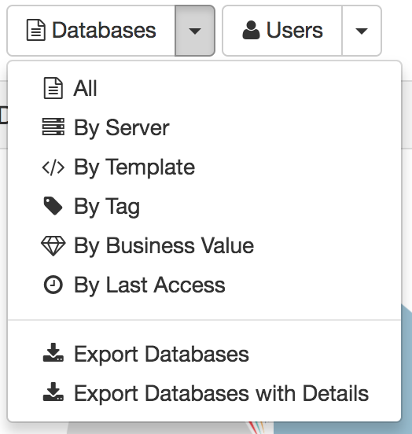

# データ出力

Adviser では、さらなるレポートや分析のためにほとんどのデータを CSV ファイルに出力することが可能です。CSV ファイルのフォーマットは Microsoft Excel に読み込むことができるようになっていますが、正確に読み込みを完了させるには以下のステップに従ってください。エクスプローラーでファイルを単にダブルクリックするだけでは、いくつかのプラットフォーム上で、Excel は正確にファイルを読み込まないことがありますので注意してください。

## 利用可能なレポート

* カタログ
    * すべてのデータベース
    * すべてのユーザー
* 利用状況
    * 使用合計値情報を含むすべてのデータベース
    * 使用合計値情報を含むすべてのユーザー
    * 詳細情報を含むデータベース: 使用の履歴が記録されたデータベース及びユーザーの組み合わせからなる行を含むレポート
* 複雑さ
    * 複雑さの合計値を含むすべてのデータベース
* ガイダンス
    * ガイダンス情報を含むすべてのデータベース 
* ログ
    * すべてのログエントリー
   
## レポートの生成
レポートはそれぞれのモジュールにおいて通常「データベース」及び「ユーザー」のドロップダウンから利用できます
<figure markdown="1">
  
</figure>

ログレポートはメインのナビゲーション・バーにあるダウンロードボタンで出力できます。
<figure markdown="1">
  
</figure>

レポートの生成には少し時間がかかる可能性があります。プロセスが完了すると、ブラウザで指定したダウンロードフォルダーに自動的にダウンロードされます。

## レポートを Microsoft Excel に読み込む
CSV は非常にベーシックなファイルで、特に日付や時刻、一部の多言語文字をサポートしていません。Adviser のデータを正確に出力できるようにするため、レポートは UTF-8 エンコーディングを使用し、日付時刻は関しては ISO フォーマットで出力しています。Excel のいくつかのバージョンでは、このようにファイルを自動的に読むことができないかもしれませんが、次のステップで示す方法に従って、ファイルを正しく読み込んでください。

1. Excel を起動し、Windows 版 Excel 2016 の場合には、データ|テキストファイル、Excel for Mac の場合には、ファイル|インポート を選択します
2. ファイル選択ウィンドウが表示されるので、読み込む CSV ファイルをクリックし、[インポート] をクリックします。
3. テキストインポートウィザードでは、「区切り記号付き」を選択します。「固定長」ではありませんので注意してください。
4. テキストインポートウィザード内の残りのステップではデフォルトの値ままにし、現在のワークシート常に配置する場所を指定します。
5. レポート内に日付を含むデータがある場合には、Excel では正しく表示していない可能性があります。日付が例えば、 *31:12.0* のような表示をしている場合には、その列を選択して、右クリックメニューから「セルのフォーマット」を選択し日付が正しく表示されるように日付のカテゴリーにあるフォーマットを指定してください。
