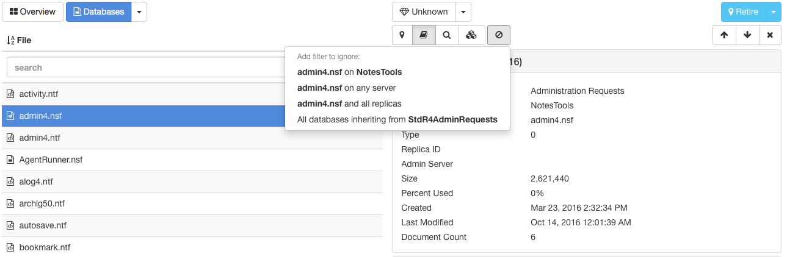
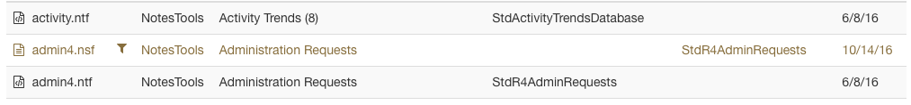
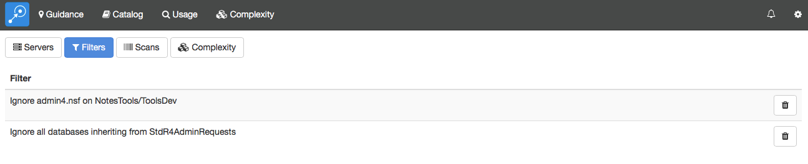

# フィルター機能

フィルター機能は、Adviser に表示するデータベース (「利用状況」モジュールの場合はユーザー)を指定することができます。Adviser は常に すべてのデータベースとユーザーのデータを収集しています。このフィルタ機能はどのデータを画面表示するかにだけに影響されます。その結果、いつでもフィルターを編集してデータベースを追加したり削除でき、過去の利用状況トレンドも含むすべてのデータを正確に表示します。

!!! note
    Adviser 6.7.0 より、データベースにフィルタをかけることで、複雑さスキャンがそのデータベースの複雑さ情報を作成/更新しなくなりパフォーマンスが向上します。複雑さ情報が以前に収集されていた場合、複雑さ情報は破棄されることはありません。複雑さ情報が古い場合、またはフィルタリングのために記録されていない場合、データベースの複雑さパネルにメッセージが表示されます。
    
## ひとつのデータベースを除外する
フィルターを作成して、それぞれのモジュールのデータベース詳細からあるデータベースを除外することもできます。データベースが指定されている状態で、各モジュールの横にある「進入禁止」ボタンをクリックして、フィルターメニューを表示します。

<figure markdown="1">
  
</figure>

このフィルターメニューで現在のサーバー上にあるこのデータベース、いづれのサーバー上のこのデータベースのパス、このデータベースのすべてのレプリカ、このデータベースと同じテンプレートから設計が引き継がれているデータベースなどを無視することができます。テンプレートを指定した場合、このフィルターメニューはこのテンプレートから引き継がれているデータベースすべてをフィルタリングするオプションが提供されます。カタログ以外のモジュールではこれらのテンプレートに関するデータを表示しなくなります。

あるデータベースをフィルターした場合、Adviser はこのシステム内ですべての利用状況のカウントとすべてのユーザーに関して再計算する必要があります。バックグラウンドのジョブとして実行しますが、完了するのに時間がかかる場合がありますのでご注意ください。同時にこのフィルター操作で結果を確認できるのに時間がかかる場合があります。さらなる詳細は[ジョブ](jobs.md)ページをご参照ください。

削除されたデータベースをフィルタリングすると利用状況カウントや他のモジュールから除かれ、より整理された状態でアプリケーションの一覧を表示することができます。一旦設定した削除されたデータベースのフィルターは以下の処理で元に戻すことも可能です。

## カタログからフィルターを削除
Catalog のデータベース一覧にはすべてのデータベースを表示しますが、フィルターが適用されているとフィルターマークが付きます
<figure markdown="1">
  
</figure>
フィルターが適用されたデータベースをクリックすると、このデータベースに適用されたフィルターが詳細表示に現れます。ここに表示されるフィルターを個別に削除することもできます。
<figure markdown="1">
  
</figure>

## 設定を使用してフィルターを削除
適用されているフィルターすべての一覧を表示できます。ステータスバーの歯車アイコンから設定ページにアクセスして必要のなくなったフィルターを削除することもできます。フィルターカテゴリを選択して、現在定義されているフィルターすべての一覧を表示したり、個別に削除することもできます。
<figure markdown="1">
  
</figure>
