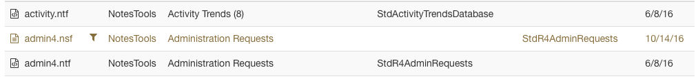
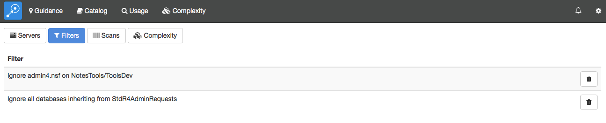

# Filters

Filters allow you to specify which databases (and users, for the usage module) will be displayed in Adviser. Note that Adviser always collects data except Complexity for all databases and users; filters only affect what data is displayed. Consequently, you can edit filters at any time to add and remove additional databases and Adviser will be able to accurately display  data, including historical usage trends.

!!! note
    As of Adviser 6.7.0, filtering a database prevents the Complexity Scan from creating/updating
    complexity information for that database to improve performance. Complexity information is not
    discarded if it has been collected previously. A message is displayed on the Complexity panel
    for a database when complexity information is out of date, or has not been recorded because of
    filtering.
    
## Excluding a Database
You can create a filter to exclude a database from the database details view in any module. With the required database selected, click the 'no entry' button that is next to the module buttons. This will display the filter menu.

<figure markdown="1">
  
</figure>

The filter menu will let you ignore this specific database on the current server, this database pathname on any server, the folder in which the database resides (if applicable), all replicas of this database or all databases inheriting from the same template as this database, if appropriate. If you select a template, the filter menu will only offer the option of filtering all databases inheriting from the template: modules other than the catalog never display data for templates in any case.

When you filter a database, Adviser needs to recompute all of the usage counts for all users in the system. This may take a little while so it runs as a background job. It may therefore take a little while before you see the results of the filter operation: see the [Jobs](jobs.md) page for further details.

Deleted databases can be filtered by selecting a database marked deleted, and choosing the filter *All deleted databases*. Filtering deleted databases will remove them from from usage counts and other modules, for a cleaner view of the applications that are still in active use.  Deleted database filters can be removed using using the procedure below.

## Removing Filters using the Catalog
The databases list in the Catalog shows all databases but marks any that are filtered with a filter icon.
<figure markdown="1">
  
</figure>
If you click on a filtered database, the details view will show the filters that apply to the database and allow you to remove them individually.
<figure markdown="1">
  
</figure>

## Removing Filters using Settings
You can view a list of all filters in effect and remove any that are no longer required from the settings page, accessed from the gear icon in the status bar. Selecting the *Filters* category will display a list of all filters currently defined and allow you to delete them individually.
<figure markdown="1">
  
</figure>
