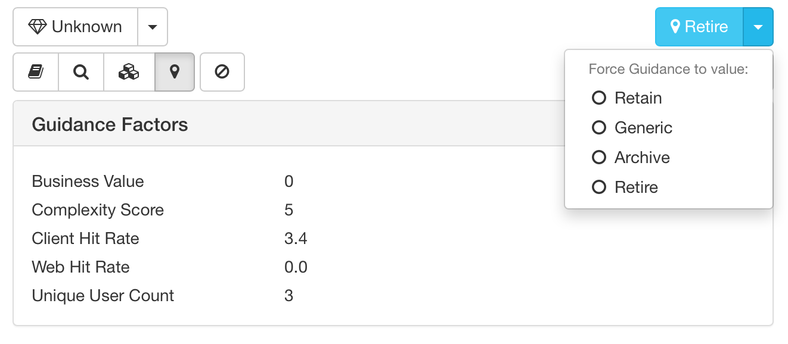

# ガイダンス

「ガイダンス」モジュールは、他のモジュールから収集したデータを組み合わせて、Domino アプリケーションの将来に向けた計画についての提案を作成します。この提案は、アプリケーションの利用状況、設計の複雑さ、ビジネス上の価値を組み合わせて行われます。

提案には 4 つの中のひとつに含まれます:

* **保持** このアプリケーションは組織にとって重要であり保持する必要があります。Domino サーバーで継続して稼働することをお考えであれば、そのままサーバー上で稼働をするべきです。新しいプラットフォームへの移行をお考えならば、移行が必要です。通常、長期でコストのかかる継続的なアクションが必要で、特にビジネス上の価値が高く、利用状況も高いアプリケーションに対してのみお勧めします。
* **アーカイブ** エンドユーザーに現在も利用が見られ、貴重なデータがあるものの、読み取り専用のアーカイブにすれば充分であるものが該当します。データベースのアーカイブをコンテンツだけの参照として、例えば、 HTML ファイルで作成しておくなどの軽量なツールを使うことをお勧めします。
* **リタイア** データ保持要件に基づいてバックアップして、削除しても構わないものが該当します。 
* **汎用** その他の代替ソリューションに置換が可能なものが該当します。単純なディスカッションデーターベースや文書ライブラリーなどは汎用アプリケーションの代表的な例です。Adviser は現在この提案を自動的に作成することはありません。例えば、Adviser はどのデータベースを CRM システムに統合すべきかを機械的に知る方法がありませんので、ご自身でこの提案の設定を行っていただくことになります。

ガイダンスは基になるデータが更新される都度自動的に提案も更新されます。システム内のデータベースすべてのデータを調査するため、実行時間が長くなります。従ってガイダンスはバックグランドタスクとして実行されます。さらなる詳細は[ジョブ](jobs.md)をご参照ください。単一のデータベースに対してビジネス上の価値を変更した場合だけは例外となります: この場合、Adviser はその該当するデータベースへの提案を直ちに更新します。

## ガイダンスの概要
「ガイダンス」の概要ページは画面上部のナビゲーションバーから「ガイダンス」を選択します。
<figure markdown="1">
  
</figure>
提案で分類されたシステム内のデータベースのサマリを表示します。Adviser のほとんどのチャート同様、パイチャート、棒グラフ、表を選択できます。

## データベース詳細の表示
特定のデータベースに対する詳細を表示するには、画面の上部にある「データベース」ボタンを選択します。これでデータベースの完全な一覧が表示されます:
<figure markdown="1">
  
</figure>

列ヘッダーをクリックすることでデータをソートできます。また、検索ボックスを使って検索テキストに合致したデータベースを表示できます。すべての列が検索され、例えばファイル名だけでなくサーバー名やガイダンスの提案も検索対象となります。

「データベース」ボタン横の下矢印で、サーバー、テンプレート、ガイダンスの結果で分類されたデータベースの一覧を表示します。

特定のデータベースをクリックすると、そのデータベースの詳細を表示ます。ガイダンス要因パネルはこの提案における測定基準を表示します。
<figure markdown="1">
  
</figure>

ガイダンスの提案は常に詳細の上部右側に薄青色の背景色で表示されています。この提案は現在表示しているモジュールに関わらず表示していますのでご注意ください。

## 自動で出された提案の書き換え
Adviser が生成した自動の提案オプションを書き換えたい状況があるかもしれません。特に、汎用 の提案に設定する唯一の方法にもなります。提案オプションをマニュアルで設定するには、詳細エリアの上部右にある色づけされたボックス内の提案の下矢印を使って指定します。
<figure markdown="1">
  
</figure>
このメニューで必要なガイダンスの値を指定できます。マニュアルでガイダンスの値を変更した場合、その提案はデータベース一覧の中で「ターゲット」アイコン付きで表示されます:
<figure markdown="1">
  
</figure>
同じく同じメニューの下矢印で提案を基に戻すこともできます。
<figure markdown="1">
  
</figure>

