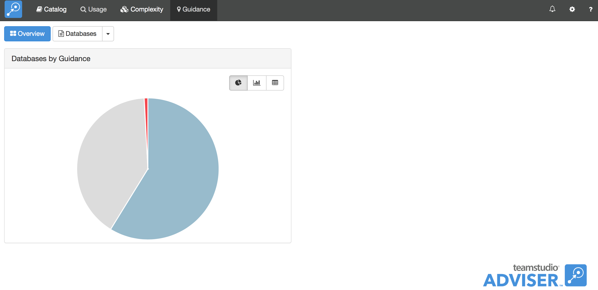
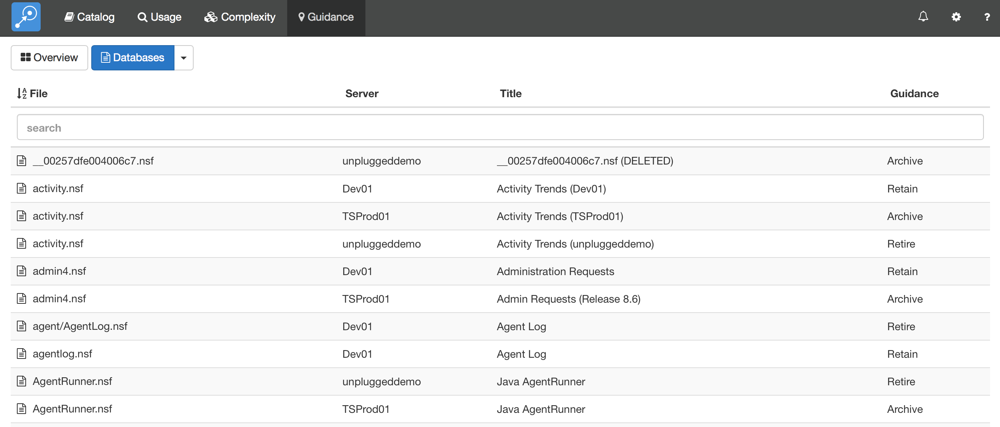
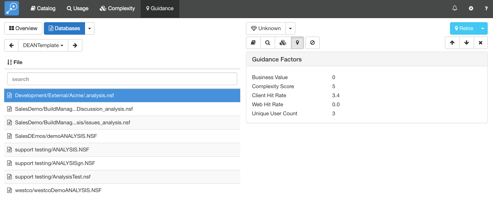
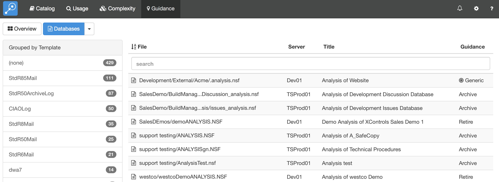
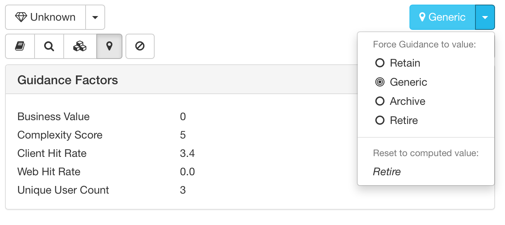

# Guidance

The Guidance module combines data from all other modules to make recommendations on the future plans for your Domino applications. The recommendation is based on a combination of the application usage, the design complexity and the business value.

The recommendation can take one of four values.

* **Retain** The application is important to your organization and needs to be retained. If you are planning on continuing to run a Domino server, these are the applications that should remain on that server. If you are migrating to a new platform, these are the applications that should be migrated. This is usually a lengthy and expensive course of action and is only recommended for applications with very high business value and usage.
* **Archive** The application contains valuable data that should still be available to your users, but a read-only archive is probably enough. You can use Teamstudio Export to create a standalone, read-only, HTML view of the application that can easily be navigated by users using only a browser.
* **Retire** The application can be backed up based on your data retention requirements and removed. 
* **Generic** The application can be replaced with an off-the-shelf product. Simple discussion databases or document libraries are an excellent example of generic applications. Adviser does not currently make this recommendation automatically as, for example, it has no way of knowing that a particular collection of databases are implementing a CRM system. You can, however, set this recommendation manually.

Guidance is updated automatically whenever any of the data on which it depends is updated. As it involves examining data for all of the databases in the system it may take a little while to run, so it runs as a background task. See [Jobs](jobs.md) for further details. The only exception is when you update the business value for a single database: in this case Adviser can immediately update the recommendation for the affected database.

## Guidance Overview
The Guidance overview page is shown when you select *Guidance* from the navigation bar at the top of the screen.
<figure markdown="1">
  
</figure>
It shows a summary of the databases in your system categorized by the recommendation. As with most charts in Adviser, you may choose to view the data as a pie chart, bar chart or table.

## Viewing Database Details
To view details for a specific database, select the databases button at the top of the screen. Clicking the button will display a complete list of databases.
<figure markdown="1">
  
</figure>

You can sort the list by clicking on any column header and use the search box to limit the display to databases that match the search expression. You can search on any column, so you can enter a server name or guidance recommendation here, not just a file name or title.

The down arrow next to the databases button allows you to list databases categorized by server, template or guidance result.

Clicking on a specific database will show you details for that database. The *Guidance Factors* panel shows the metrics that contribute to the recommendation.
<figure markdown="1">
  
</figure>

Note that the guidance recommendation is always shown at the top right of the details area with a light blue background. The recommendation is shown regardless of which module you are currently viewing.

## Overriding the Automatic Recommendation
There may be situations where you want to override the automatic recommendation that Adviser has generated. In particular, this is the only way to set the Generic recommendation. To manually set a recommendation, use the down arrow next to the recommendation in the colored box at the top right of the details area.
<figure markdown="1">
  
</figure>
This shows a small menu allowing you to specify the required guidance value. If you set the guidance value manually, the recommendation is shown with a 'target' icon in database lists.
<figure markdown="1">
  
</figure>
You can revert to the computed recommendation from the same menu accessed via the down arrow.
<figure markdown="1">
  
</figure>

