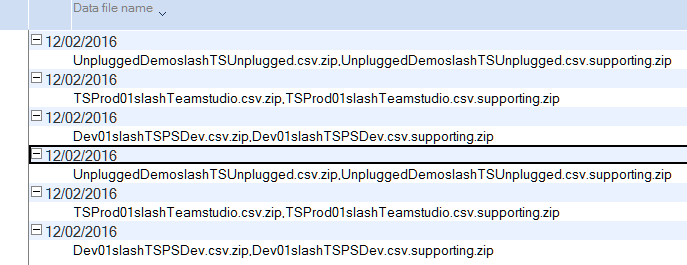

# Teamstudio Usage Auditor から利用状況データをインポートするには

Teamstudio Usage Auditor の最新バージョンから Teamstudio Adviser へアップグレードされるお客様は、Usage Auditor でこれまで収集してきたデータを Adviser にインポートできます。

利用状況データは Usage Auditor アプリケーションのサーバー設定でデータ収集期間 "Save Supporting Data" への設定がされている場合にインポートできます。Adviser は詳細フィルタリングオプションを有効にするこのサポートデータファイルの完全な詳細データに基づいています。より詳細な情報は以降の必要要件を参照してください。

## 必要要件 
Adviser は Usage Auditor の利用状況レポート作成スキャン実行中に収集したソースファイルを使用して、Usage Auditor の以前のバージョンから利用状況データをインポートします。

Usage Auditor はこのソースファイルを、対象サーバーのサーバー設定で *Save Supporting Data* が設定されている場合に保存されるようになっています。この設定は、Usage Auditor データベースのサーバー文書にあり、*Admin > Server Configuration* で確認できます。

さらに利用状況データのインポートには、次にあげる条件が整っていなければなりません。

* Usage Auditor がスキャン中に *Save Supporting Data* の設定がされていたこと。
* Usage Auditor データベースのコピーが、Adviser ワークステーション (Notes クライアントで Adviser が必要なジョブを処理できるように構成されているワークステーション）上にあること。
* Usage Auditor で定義したサーバーのすべてが同様に Adviser でも定義されていること。
*Adviser の直近のスキャンが有効に分類されているすべてのサーバーで成功していること。

Adviser は Usage Auditor 4 と 5 のフォーマットを持つファイルインポートをサポートします。

## 保存したサポートデータの検証
Usage Auditor には *Supporting Data* のビューがあり、*表示 > 移動* メニューで確認できます。

<figure markdown="1">
  
</figure>

このビューで、Adviser がインポートする生データを確認できます。収集した日付別に分類されています。ビュー内の添付ファイルの名前が一覧表示され、その中にはデータを収集したサーバーの名前も含まれています。

Adviser はこのビューの日付の範囲にあるデータをインポートします。Adviser に必要のない古いデータのインポートを制限したい場合には、必要に応じて Usage Auditor データベースのバックアップコピーを取ったうえで、データを削除してください。

これらのファイルの期間に空白がある場合、*Save Supporting Data* が無効になっていたか、利用状況の収集の実行が失敗（たとえば、ワークステーションがシャットダウンしていたなど）が考えられます。Usage Auditor 5.x では最後にスキャンしてからのサーバー上のアクティビティをすべて収集するので、データは 10 日の間隔よりも少なければデータが失われることはありませんが、4.x では夜間に前日のデータだけを収集していたので失われている可能性が高いと言えます。もし、著しい空白期間がある(5.x では 10 日以上)は、この空白期間によってインポートするデータの正確性に支障をきたす可能性がありますが、レポート期間を短くするなど考慮してください。

## サーバーのスキップ  
データのインポートではすべてのサーバーが定義されている必要があり、インポートの前に Adviser でそのサーバーに対するスキャンが成功していなければなりません。

Usage Auditor からインポートするデータの中に、もう現在存在していないサーバーのデータがある場合、あるいは、インポートしたくない場合には Adviser でそのサーバーの定義を作成したうえで、無効に設定してください。

## Usage Auditor のデータインポートの操作  
Adviser に Usage Auditor のデータをインポートは以下の手順に従ってください。

1. Usage Auditor データベースを Adviser ワークステーションクライントにコピーします。
2. Usage Auditor 内の *Supporting Data* ビューをレビューします。 (前出).
3. 必要に応じて Usage Auditor に合致するようサーバー定義を Adviser に追加作成します。(インポートしないサーバーには、逆に無効にします)
4. Adviser のスキャンを実行し(Adviser のブラウザ UI の *Settings  > Server* ページ)、スキャンが成功するか検証してください。
5. Adviser ワークステーションの Notes クライアントから Adviser サーバーアプリケーションを開き、アクション > *Upgrade / Reimport Usage* で Usage Auditor データベースを指定しインポートを開始します。

このインポート操作はひとつの Adviser ジョブとして実行します( UI でスキャンが実行されるのと同様)ので、ブラウザーアプリを再ロードして進捗を管理することができます。

## Usage Auditor 4.x and 5.x の両方の利用状況データをインポートする際に
Notes/Domino のタイムスタンプは 100 分の 1 秒の精度で保存され、Usage Auditor 5.x では、それと同じ精度でサーバーアクティビティを記録します。

つまり、Adviser も 100 分の 1 秒のアクティビティのタイムスタンプを使用しているので、アクティビティを記録したりインポートする際に、データがユニークになることを保証しています。それゆえ、5.x から重複する利用状況データをインポートしたとしても、このタイムスタンプをもとに重複を防ぐことができ安全と言えます。

Usage Auditor 4.x は Domino サーバーから 1 秒単位のタイムスタンプの精度でアクティビティを収集します。Usage Auditor 4.x のデータをインポートするとインポートした Usage Auditor 5.x のデータとある時間範囲でオーバーラップし、利用状況が重複した回数で記録されますのでご注意ください。