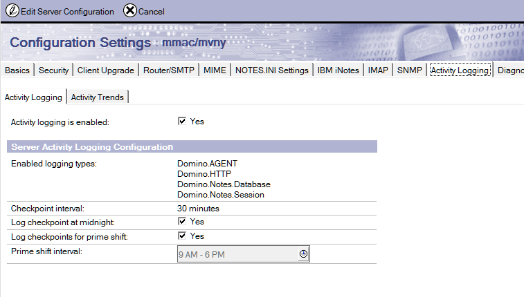
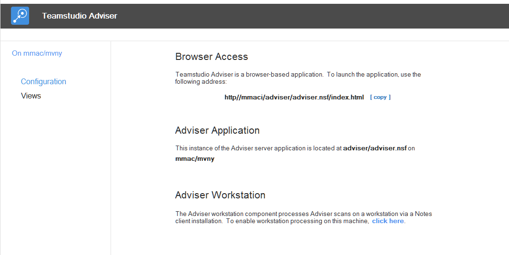
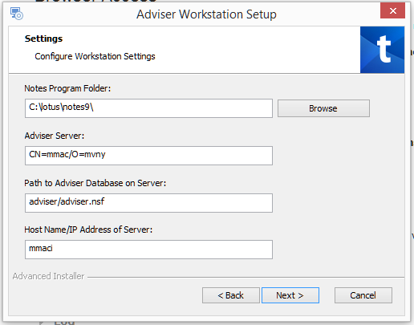
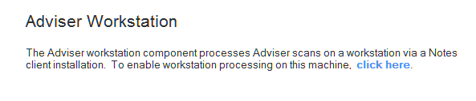
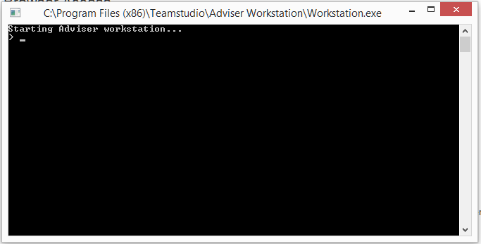

# Teamstudio Adviser のインストール

Teamstudio Adviser はふたつの HCL Domino アプリケーションから構成されており、ひとつは Domino サーバー上に配置する HCL Domino アプリケーションで、もうひとつは HCL Notes クライアントがインストールされたワークステーション上で実行されるプログラムです。

Adviser サーバーのアプリケーションは、Adviser のブラウザ・ベースのユーザーインターフェースを提供し、Adviser モジュールに対するデータベースとユーザーの様々なレポートを生成し、Adviser によって収集したすべてのデータを格納します。Adviser サーバーは、テンプレート TSAdviser.ntf を基にして HTTP タスクの起動しているサーバー上に NSF を作成し配置します。そして設定は Web ブラウザを介して行います。

Adviser ワークステーションは、Adviser サーバーによって生成されたレポートの基礎になるデータを収集する役割を担っています。Adviser ワークステーションは HCL Notes のインストールされたワークステーション上に、インストーラー(サーバー NSF の中に格納されています)を起動することで配置されます。このインストールされたプログラムは、Adviser サーバーに接続するようにインストーラーによって構成され、必要に応じて Adviser のスキャンプロセスを起動し続けます。スキャンはリソースを著しく消費するプロセスですが、異なるワークステーションから実行して、サーバーパフォーマンスの Adviser からのインパクトを抑制し、複数ドメインのアクセスを容易にする利点があります。

## 既存のインストールをアップグレードする方法
Adviser 6.0 以降の既存のインストールからアップグレードする場合には[アップグレード方法](#upgrading)セクションを参照してください。そうでない場合は、下の方法に従ってください。

## HCL Domino サーバーのシステム要件
Teamstudio Adviser の Web ユーザーインターフェースは、Domino サーバーのバージョン 8.5.3 以降の HTTP タスクが稼働している環境で運用します。

* Domino 8.5.3 では、少なくとも Fix Pack 3 と Upgrade Pack 1 (または XPages Extension Library) がインストールされていなければなりません。
* 上記に必要なコンポーネントは Domino 9.0 以降に含まれているので、追加のコンポーネントは必要ありません。

Teamstudio Adviser ワークステーションは HCL がサポートする Microsoft Windows 上の Notes 8.5.3 以降の 32 ビットをサポートしています。HCL Notes ワークステーションにには最新の Fix Pack が適用されていることを推奨します。

## 利用状況データ収集の前提要件
Teamstudio Adviser の利用状況モジュールは HCL Domino サーバーの Activity Logging のタスクで収集したデータを元に、その集積とレポートを行います。

利用状況の収集には、対象となるそれぞれのサーバーすべてに Activity Logging が必ず有効化されている必要があります。

BM Domino サーバーの Activity Logging を有効にする説明を以下に示します。

1. Teamstudio Adviser でスキャンする対象のサーバーにある Domino Dディレクトリーを開きます
2. 次に「設定」ビュー → サーバー → サーバー設定を選びます
3. スキャン対象の HCL Domino サーバーの文書がすでにある場合には、その文書を編集モードににします。ない場合には、スキャン対象の HCL Domino サーバーのサーバー文書を新規作成します
4. これが新規のサーバー文書の場合、Teamstudio Adviser でスキャンする HCL Domino サーバーを指定します
    * 複数の HCL Domino サーバーをスキャンしようとする場合には、それぞれに用意する必要があります
5. Activity Logging タブに切り替え、Activity Logging を有効にします
6. 「有効なログタイプ」でが次のオプションを指定してください:
    * Domino.AGENT
    * Domino.HTTP
    * Domino.Notes.Database
    * Domino.Notes.Session
7. サーバー文書を保存して閉じます

これで HCL Domino サーバーの Activity Logging が有効になります。複数の HCL Domino サーバーに対して作業した場合には、Domino ディレクトリーが他のサーバーに複製されているのを確認してください。

<figure markdown="1">
  
</figure>

デフォルトでは、アクティビティはサーバー上の Log.nsf に記録され、ある一定期間 Log.nsf にアクティビティを保持するようになっています。Teamstudio Adviser は毎晩利用状況データを収集し、常に新しいデータのみをインポートします。ある夜の収集が失敗したとしても、データの保持期間内であれば利用状況データが失われることはありません。

## Teamstudio Adviser アプリケーションのインストールと設定

### Teamstudio Adviser アプリケーションテンプレートの入手
Teamstudio Adviser アプリケーションは 2 つのパーツから構成されています:

1. Teamstudio Adviser ドミノアプリケーションファイル (.NSF)
2. Teamstudio Adviser ワークステーションクライアント (コマンドライン・インターフェース)

これらの両方は、HCL Domino テンプレートファイルの中に含まれて提供されており、次の URL にある Teamstudio の Web サイトからダウンロードできます: [https://jp.teamstudio.com/adviser-download-page](https://jp.teamstudio.com/adviser-download-page).

### Teamstudio Adviser アプリケーションの作成
Teamstudio Adviser アプリケーションテンプレートを入手したら、Teamstudio Adviser アプリケーションを作成します。データはここに格納されます。

以下のステップで行うべきプロセスを簡単に示します:

1. テンプレートファイルを HCL Notes クライアントのデータディレクトリーに移動します
2. HCL Notes クライアントから、「ファイル」→ 「アプリケーション」→ 「新規作成」を選択します
3. 表示されるダイアログで以下の情報を入力します:
    * **サーバー** Adviser アプリケーションを配置するサーバーを指定します
    * **タイトル** 任意ですが通常「Teamstudio Adviser」
    * **ファイル名** 通常、「TSAdviser.nsf」です。ファイル名にサブディレクトリーを指定することも可能です(例 “Teamstudio\TSAdviser.nsf”)
    * **テンプレート** リストから“Teamstudio Adviser” テンプレートを指定します
    
上記の内容を入力したら「OK」ボタンを押しアプリケーションを作成します。

アプリケーションが作成されると、HCL Notes クライアント上で自動的に開きます。その際、認証の警告が表示されます。これは Teamstudio Adviser アプリケーションの設計が Teamstudio の ID で署名されているからです。ご自身の組織の Notes 署名 ID で再度署名するには次のステップに従ってください:

1. HCL Domino Administrator アプリケーションを起動します
2. Teamstudio Adviser アプリケーションを作成した HCL Domino サーバーに切り替えます
3. 「ファイル」タブから Teamstudio Adviser アプリケーションを指定します
4. Teamstudio Adviser アプリケーションをハイライトし右クリックし、「署名...」を選択します
5. 表示されるダイアログで、サーバー上でアプリケーションが動作させるのに必要な署名者の Notes ID を指定するか、HCL Domino サーバーのサーバー ID を指定します
6. 「OK」をクリックし署名を完了させます

HCL Domino サーバー上の設計の署名におよそ 1- 5 分程度かかります。

インストールが正常に行われアプリケーションを開くと、下のイメージに似たスクリーンが表示されます:

<figure markdown="1">
  
</figure>

### トランザクション・ロギング
Adviser サーバー NSF が配置されているサーバー上で Domino のトランザクション・ロギングが有効になっている場合、Adviser データベースに対しては無効にするため、データベースプロパティの詳細タブにある「トランザクション・ロギングを無効化」にチェックを入れてください。Adviser に対してはスキャンがエラーなどがないか安全に繰り返しが行われるようにトランザクション・ロギングは必要ありません。トランザクション・ロギングを有効にすると Adviser が行う大量の更新でトランザクション・ログが制限値に到達しサーバー上で問題を引き起こす可能性があります。

### アクセス制御リスト (ACL) の調整
デフォルトでは、Teamstudio Adviser サーバーは「アクセスなし」で「パブリック文書[読者]」の権限のある「Anonymous」のACLエントリが必要です。この設定は Adviser ワークステーションがクライアント側でのジョブが完了したとき、サーバー側でのジョブを起動するのに必要です。Anonymous のアクセスはジョブを作成したりデータにアクセスするために使用できません。Webブラウザアプリケーションをサポートする Adviser のサービスで必要な権限として、Anonymous をそれ以上の高い権限に設定しないでください。Anonymous に高い権限を与えることは、サーバーが権限を必要とするのを妨げてしまうことになります。

サーバーへの Anonymous アクセスを許可していない環境である場合（例えば、サーバー文書でサーバーレベルで許可していない）にはAdviser に HTTP ユーザー名/パスワードを格納しておき、こういったアクセスを可能にすることができます。詳細の情報は、 Teamstudio の技術サポート techsupport@teamstudio.com までご連絡ください。

通常、Adviser に設定するその他の ACL 設定は、普通のノーツアプリケーションに適用するのと同じ方法でブラウザアプリケーションにも適用できます。

「-Default-」アクセスは匿名のアクセスとして、必要となるどのレベルのアクセスにもアサインできます。

### 日時のスキャンをスケジュールするには
一般的に 7- 10 日間のデータを保持し以降破棄されるサーバー上の log.nsf から Adviser はアクティビテイィのデータを収集しますので、データが欠損なく収集されることを保証するため利用状況のスキャンは常に一定間隔で起動しておく必要があります。

スキャンを夜中に必ず行うようにするため、Teamstudio Adviser アプリケーションには有効にしておく必要のあるスケジュールエージェントがあります。この作業には、HCL Domino Designer がインストールされており、Teamstudio Adviser アプリケーションに設計権限以上があることと、サーバー上でエージェントを動作させることができる Notes ID が必要です。このスケジュールエージェントを有効にするには次のステップに従ってください:

1. HCL Notes ワークステーションに Teamstudio Adviser アプリケーションをハイライトします
2. Teamstudio Adviser ワークステーションを右クリックし、メニューから「アプリケーション」→ 「エージェントへ移動」を選択します。
3. エージェントのリストから“Scheduled Nightly Scan”を選択します
4. エージェントリスト上部の「有効化」ボタンをクリックエージェントを実行するサーバーを指定します

HCL Domino Designer を閉じます。

このエージェントはデフォルトでは夜中の午前 1 時に毎日起動します。実行開始時刻は必要に応じて変更していただけます。

この *Schedule Nightly Scan* エージェントは、アプリケーションにある 今すぐスキャン ボタンで行われるマニュアルのスキャンと同じプロセスが実行されます。このスキャンで、カタログ情報の更新、前回のスキャンからの差分となる利用状況、関連情報の再計算などを行います。ワークステーションの処理はこのスキャンのリクエストを処理するために必ず有効になっていなければなりません。

### 設定
Teamstudio Adviser サーバーでの設定の最後のステップは、スキャン対象のサーバーを指定することです。Web アプリケーションの Settings (設定) ページで行えます。設定ページは Adviser ナビゲーションバーの右側にある歯車アイコンからアクセスできます。詳しくは[サーバー](settings_servers.md)を参照してください。

## ワークステーション上に Adviser データ収集アプリケーションをインストールする方法

### HCL Notes クライアントワークステーションの前提条件
Teamstudio Adviser アプリケーションが HCL Domino サーバーからデータを収集させるには、HCL Notes クライアントがインストールされたコンピューター上に、収集アプリケーションをインストールする必要があります。このコンピューターには次の HCL Notes クライアントの構成が必要です:

1. 最新の Fix Pack が適用されたバージョン 8.5.3、あるいは、少なくとも Fix Pack 6 以降が適用されたバージョン 9.0.1
2. スキャン対象のそれぞれの HCL Domino サーバーと Teamstudio Adviser を配置したサーバーに対してフルアドミニストレーションの権限のある Notes ID でクライアントがセットアップされていること
3. セキュリティオプション「他の HCL Notes ベースのプログラムでパスワードプロンプトを表示しない」が有効になっていること
    * この設定は HCL Notes のメニュー「ファイル」→ 「セキュリテイ」 → 「ユーザーセキュリティ」で行えます。

!!! note
    Teamstudio Adviser ワークステーションの複雑さが、クライアントのスキャンタスクを実行するため、物理的及び仮想のコンピューターに関わらず、専用のコンピューターを使用することを強く推奨します。このコンピューターは、一日 24 時間再起動やログアウトされることのないようにしなければなりません。

Adviser ワークステーションは、クライアントワークステーションからスキャンを実行できる実行可能なアプリケーションです。アクティビティをスキャンしレポートすることは、複数のサーバーにアクセスし、コンピュータープロセスの一部として動作する非常にリソースを消費するアものになります。

こうしてスキャンした利用状況アクティビティデータは、順次サーバーアプリケーションへ書き込みされ、Web ブラウザインターフェースを経由して利用できます。

Adviser ワークステーションはローカルの定期エージェントが動作する環境が必要で、保留されたジョブに対するサーバーアプリケーションの監視や、データ収集を動作させるの必要となります。 

アプリケーションはスキャン対象となるそれぞれのサーバーの Log.nsf ファイルに少なくとも読者権限のアクセスをもつ ID でインストールまたは動作させなければなりません。複雑さデータ収集が必要であれば、それぞれのアプリケーションに対しても同様のアクセス権がなければなりません。サーバー群が複数ドメイン内に存在している場合には、すべてのサーバーに対して相互認証されている ID とワークステーションが必要となります。

またこの ID は Adviser サーバーアプリケーションに対して、編集者(削除権限付き)の ACL アクセスを設定しなければなりません。

### Adviser ワークスーテーションアプリケーションをインストールするには
1. Adviser ワークステーションが動作するワークステーション上で、データ収集に使用される ID で HCL Notes クライアントにログインします。
2. Notes クライアントのセキュリティ設定で「他の HCL Notes ベースのプログラムでパスワードプロンプトを表示しない（セキュリティが低下）」にチェックしてください（ファイル > セキュリティ > ユーザーセキュリティ）。これは実行モジュールを動作させるのに必要となります。
3. Notes クライアントで Adviser サーバーアプリケーションを開き、「Adviser ワークステーション」とタイトルのあるセクションのワークステーションを有効にするリンクをクリックします。 
4. Adviser インストールプログラムが起動します。プロンプトに従って処理を進めます。セットアップの途中、ワークステーションに対する設定情報を指定する設定ページが表示されます。サーバーに正しく接続するため以下の情報を確認して指定してください。:
   

インストールが完了すると、ワークステーションが起動するようになっています。

### Adviser ワークステーションの起動
インストールが完了している状態であれば、Adviser ワークステーションをインストールの際に使用した同じリンクをクリックして起動させることができます。Notes クライアントで Adviser サーバー NSF を開き、設定ページにある Adviser ワークステーションというタイトルのセクションのリンクから起動してください。:

<figure markdown="1">
  
</figure>

Adviser ワークステーションは同様に、Workstation.exe という実行ファイルを起動することでT動作します。デフォルトでは &lt;Program Files (x86)&gt;\Teamstudio\Adviser Workstation\Workstation.exe になります。

起動すると、ワークステーションのウィンドウが開き、保留になっているスキャンの監視を開始します:

<figure markdown="1">
  
</figure>

!!! note
    Adviser ワークステーションのアプリケーションは、スキャンのプロセスを完了させるのに、常に動作し続けている必要があります。起動は毎日午前 1 時（サーバー時刻）に行われます。
    スキャンする HCL Domino サーバーに対する利用状況の正確な内容を掴むためには、少なくとも 30 日は継続していただくことをお勧めします。

### ワークステーション - サーバー間の接続
Adviser ワークステーションは HTTP を経由して Adviser サーバーに接続する必要があります。

サーバーやデータベースをスキャンし Adviser サーバーにデータを書き込むほとんどのワークステーション側の処理は、Notes クライアントと NRPC を通じて行われます。

クライアント側のジョブが完了した際、サーバー側の処理を起動させるために、Adviser は HTTP 経由で REST サービスのエンドポイントを呼び出し、更新したデータを処理するサーバーアプリケーションを起動します。

デフォルトのワークステーション設置では、サーバーのアドレス帳に定義されている最初のホスト名でサーバーに接続しようと試みます。その接続はポート 80 番の SSL なしで行われます。

それぞれのサーバーに対して SSL 接続が必要な場合や、他のポート番号を使用して接続したい場合には、ワークステーションデータベースの「Workstation Configuration」文書にある HTTP Host Name フィールドを編集し変更できます。デフォルトでは、このフィールドはホスト名だけが入っています。プロトコルやポート名を次のように指定することもできます(例、https://teamstudio.com:499 ポート番号 499 上の SSL接続)。Adviserワークステーションとして振る舞う Notes クライアントを完全に終了させ、この設定を有効にするため再起動が必要です。この設定に関して、ヘルプが必要な場合は、チームスタジオのサポートへご連絡ください。

Notes に実装されている Java 6 JVM の制限により、大きなキーサイズの SSL は正常に動作しない可能性があります。

Adviser をホストするサーバーで Anonymous の接続が許可されていない場合には、ワークステーションは HTTP のユーザー認証を使用するように構成できます。ログインに使用するユーザー名とパスワードは通常のアクセスを防ぐためハッシュされ、ワークステーション上のあるローカルデータベースに格納されます。格納には Notes の暗号フィールドに現在の ID で暗号化しフィールド内に格納されます。このような認証を有効にするには「http auth」コマンドをワークステーションのコンソールに入力します。（「help http auth」を入力するとコマンドの使用方法が表示されます）。

### Adviser ワークステーション - コンソールコマンド
Adviser のワークステーションではコンソールから限定した数の管理コマンドを使用することができます。利用できるコマンドのリストを表示するには、コンソールで「help」とタイプしてください。あるコマンドの追加の使用方法に関する情報を表示するには「help &lt;command&gt;」とタイプすると表示されます。
  
## Adviser のアップグレード方法
Adviser 6.0 以降のバーションからアップグレードするには次のステップに従ってください。 

### Adviser サーバーのアップグレード
1. ターゲットサーバー上でコードを実行するのに必要な適切な ID で新しく入手したテンプレートに署名します（通常、管理者ID）
2. この新しいテンプレートでサーバーにある Adviser のデータベースの設計を更新します。
3. 「restart task http」コマンドを使って HTTP タスクを再起動します。(これは"quit http"してから続けて"load http"するのと同じです。"tell http restart" では、完全に JVM をリリースして新しいコードを発行することができませんので、使用しないでください)。

### Adviser Workstation 6.1 以前からのアップグレード
1. Adviser ワークステーションのアプリケーションが起動していた場合には終了させます
2. Windows のコントロールパネルより「プログラムの追加／削除」で Adviser ワークステーションをアンインストールします
3. Adviser のサーバーNSFから Adviser ワークステーションをガイドに従ってインストールします。

### Adviser ワークステーション 6.1 以前からのアップグレード
6.2 より前の Adviser ワークステーションのインストールは、Notes クライアント内のローカル定期エージェントとしてワークステーション・コンポーネントを起動していました。これは、Notes の "data" ディレクトリーに配置される *TSAdviserWS.nsf* というアプリケーションでした。アップグレードには次の手順に従ってください:

1. ワークステーションとして動作していた Notes クライアントを完全に終了させてください(タスクマネージャーで完全に終了しているか確認してください)。
2. クライアントのデータディレクトリーから *TSAdviserWs.nsf* を削除してください。
3. Notes クライントを再起動し、Adviser サーバーアプリケーションを開きます。
4. 前出の Adviser ワークステーションのインストールの説明に従って、ワークステーションをインストールします。
5. ブラウザ UI 内で新しいスキャンをスケジュールしてください。これで、新しいバージョンに必要なデータがアップデートされ、新しい機能が有効になります。ワークステーションを再起動する間に、新しいスキャンをスケジュールのが安全です。ワークステーションがアクティブになればスキャンは自動的に開始されます。

お客様が Adviser ワークステーションのベータバージョン6.2、つまりコマンドライン・アプリケーションをご使用になっている場合には、そのアプリケーションを終了し、前出の説明にある新しいワークステーション・アプリケーションをインストールしてください (新しいバージョンをインストールするには提供されているバージョンにもよりますが、 Windows のコントロールパネスの「プログラムと機能」で Adviser ワークステーションでアンインストールを施される場合もあります)。

### ブラウザとパスワード保存に関して
Adviser はブラウザ内の「パスワード保存」を使用した運用を現在サポートしていません。以前に保存したパスワードはブラウザの設定ページから削除してください。

### Usage Auditor からの利用状況データをインポートするには
利用状況データを収集している期間中、設定 Save Supporting Data 設定が有効になっていれば、Teamstudio Usage Auditor からデータをインポートできます。 [詳細は Importing from Usage Auditor を参照してください。](importing.md)