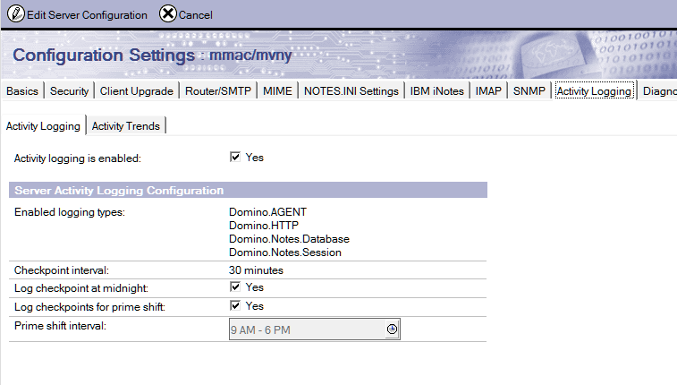
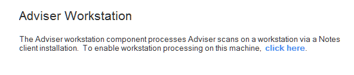
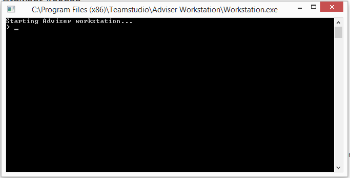

# Installing Teamstudio Adviser

Teamstudio Adviser consists of two components, an HCL Domino application hosted on a Domino server, and an executable program that runs on a workstation with an HCL Notes client installed.

The Adviser server application provides Adviser's browser-based user interface, generates reports on databases and users for the Adviser modules, and stores all data collected by Adviser. Adviser server is deployed by creating an NSF based the template *TSAdviser.ntf* on the desired server, and configuring it via web browser.

The Adviser Workstation is responsible for collecting the data that forms the basis for the reports generated by the Adviser server. Adviser Workstation is deployed by running an installer (contained in the server NSF) on a workstation installation of HCL Notes. The installed program is configured by the installer to connect to the Adviser server, and remains running to process Adviser scans as needed. Scans are resource intensive processes; running scans from a client workstation limits the impact of Adviser on server performance, and allows easier configuration and access to servers in multiple domains.

## Upgrading an Existing Installation
If you are upgrading an existing installation of Adviser 6.0 or above, you can skip directly to the [upgrading](#upgrading-adviser) section. Otherwise continue to follow the instructions below.

## HCL Domino Server System Requirements
Teamstudio Adviser is supported on all HCL-supported Notes/Domino versions.**

The web interface for Teamstudio Adviser can be hosted on Domino servers with the HTTP task enabled.

* For Domino 8.5.3, the server must have a minimum of Fix Pack 3 installed, and must have Upgrade Pack 1 installed (or equivalent version of the Xpages Extension Library).
* The required components are included in Domino 9.0 and greater; no additional components are required.

The Adviser Workstation can be run on a Notes Client version 8.5.3 and higher (32-bit) running on supported versions of Microsoft Windows. We recommend the most recent Fix Pack version also be installed on the HCL Notes workstation.

** Adviser is known to run well in most 8.5.3+ Notes/Domino environments, however, Teamstudio support may be limited regarding issues related to unsupported versions of Notes or Domino.

## Prerequisites for Usage Data Collection
The Usage module of Adviser aggregates and reports on data collected by the HCL Domino server’s Activity Logging task.

In order to use Usage Auditor, Activity Logging will need to be enabled and running on the HCL Domino server(s) that will be scanned by the Adviser application.

Below are the instructions for enabling Activity Logging for your HCL Domino server(s):

1. Open the Domino Directory on the server(s) that will be scanned by Teamstudio Adviser.
2. Navigate to the View *Configuration -> Servers -> Configurations*.
3. If a document already exists for the HCL Domino server(s) that will be scanned then place the document into Edit mode. If there is not a document for the HCL Domino server(s) that will be scanned then click the “Add Configuration” Action button.
4. If this is a new document then list the HCL Domino server(s) the will be scanned by Teamstudio Adviser.
    * If you are intending on scanning multiple HCL Domino servers then you can list them all here.
5. Switch to the Activity Logging tab and ensure that Activity Logging is enabled.
6. In the “Enabled logging types” field ensure that the following options are selected:
    * Domino.AGENT
    * Domino.HTTP
    * Domino.Notes.Database
    * Domino.Notes.Session
7. Save and close the document.

This will also enable the Activity Logging task on the HCL Domino server(s) that you listed. If you listed multiple HCL Domino servers on the document you must make sure that the Domino Directory is replicated to the additional servers.

<figure markdown="1">
  
</figure>

By default, Activity Logging is stored the *log.nsf* database on the HCL Domino server, and the retention period for *log.nsf* applies to activity as well. By default, Adviser will collect usage data every night and will import any new data. If collection fails, no data will be lost as long as the problem is resolved within the retention period.

## Installing and Configuring Teamstudio Adviser Application

### Acquiring the Teamstudio Adviser Application Template
The Teamstudio Adviser application is comprised of two parts.

1. The Teamstudio Adviser Domino application file (.NSF.)
2. The Teamstudio Adviser Workstation client (command line interface.)

Both of these parts are contained within an HCL Domino Template file which can be obtained from the Teamstudio Website at the following URL: [https://www.teamstudio.com/adviser-download-page](https://www.teamstudio.com/adviser-download-page).

### Creating the Teamstudio Adviser Application
Once you have acquired the Teamstudio Adviser application template, you can create the Teamstudio Adviser application where the data will be stored.

This is a simple process to perform by following the steps below.

1. Move the template file into your HCL Notes Client’s Data directory.
2. From your HCL Notes Client select the following menu option *File -> Application -> New...*.
3. In the dialog that is presented, enter the following information.
    * **Server** Select the server where you wish to place the Adviser application.
    * **Title** This is normally *Teamstudio Adviser*.
    * **File name** This is normally *TSAdviser.nsf*. You can also indicate a subdirectory at the beginning of the file name (e.g., *Teamstudio\TSAdviser.nsf*.)
    * **Template** Select the *Teamstudio Adviser* template from the list.
    
Once these options have been entered you can press *OK* to create the application.

Once the application has been created it will automatically launch into your HCL Notes client. You may receive a Certificate Warning message. This is due to the fact that the design of the Teamstudio Adviser application is currently signed by a Teamstudio ID. To re-sign with your organization’s Notes Signature follow the steps below.

1. Open your HCL Domino Administrator application.
2. Switch to the HCL Domino server where you created the Teamstudio Adviser application.
3. From the *Files* tab, locate the Teamstudio Adviser application.
4. Right click on the Teamstudio Adviser application and select *Sign...*
5. In the dialog that is presented, select either *Active User’s ID* if you are using a Notes ID which has the ability to properly sign designs on the server or optionally select *Active Server’s ID* to sign the design with the HCL Domino server’s ID file.
6. Click *OK* to complete the process.

Design signing on the HCL Domino server will take approximately 1-5 minutes.

If installation is successful, you should see the application home screen similar to the image below.

<figure markdown="1">
  
</figure>

### Transaction Logging
If Domino Transaction Logging is enabled on the server where the Adviser server NSF is deployed, be sure to disable it for the Adviser database by checking *Disable transaction logging* in the Advanced tab of the database properties dialog. Transaction Logging is not needed for adviser since scans can be safely repeated if there is an error or outage. Enabling transaction logging may cause problems on the server, since the large number of updates Adviser makes while updating its documents can cause the transaction logs to hit size limits.

### Access Control List (ACL)
By default, Teamstudio Adviser server requires that the ACL entry *Anonymous* be defined as *No Access* and given the privilege *Read Public Documents* – this setting allows the Adviser workstation to trigger server-side job processing when client-side jobs have completed. Anonymous access cannot be used to create jobs or access data. Anonymous should not be set to a higher level of access, as authentication is required by the Adviser services that support the web browser application.  Allowing anonymous higher levels of access will prevent the server from requiring authentication. 

If the environment does not allow Anonymous access (for example, it is prohibited at the server level via the Directory's Server document), it is possible to configure Adviser to store and use an HTTP Username/Password combination for this access.  For more information, contact Teamstudio support at techsupport@teamstudio.com.

In general, other ACL settings in Adviser are applied to the browser application in the same manner they are applied in traditional Notes applications.

The *-Default-* access setting can be used to assign any level of access desired in place of anonymous access.

### Scheduling Daily Scans
Since Adviser extracts activity data from the server's log.nsf, which typically keeps 7-10 days of data, it is important to run Usage Scans on a regular basis to ensure the data is up-to-date and without gaps.

To ensure that overnight scans occur, within the Teamstudio Adviser application there is a scheduled agent that needs to be enabled. To enable this Scheduled Agent follow the steps below.

1. Locate the newly created Teamstudio Adviser application on you HCL Notes Workspace.
2. Right click on the Teamstudio Adviser application and from the menu that is presented select *Application -> Go To Agents*.
3. In the list of Agents, locate and select the agent *Scheduled Nightly Scan*.
4. At the top of the Agents list, click on the button labeled *Enable*.

You can now close your HCL Domino Designer.

By default, this agent will run once daily, at 1:00 AM. The run time can be modified to another time if desired.

The *Schedule Nightly Scan* agent initiates the same process as triggering a manual scan using the *Scan Now* button in the application. The scan will update Catalog information, import Usage since the last scan, and recalculate any affected metrics. Workstation processing must be enabled for the scan request to be processed.

### Configuration
The final step in configuring the Teamstudio Adviser server is to select the servers to scan. You can do this from the Settings page in the web application, accessed via the gear icon on the right of the Adviser navigation bar. See [Servers](settings_servers.md) for more details.

## Installing the Adviser Workstation

### HCL Notes Client Workstation Prerequisites
In order for the Teamstudio Adviser application to collect the data from your HTML Domino server(s) an application must be installed onto a computer where an HCL Notes Client is also installed. This computer will require the following HCL Notes Client configuration.

1. Version V8.5.3 with the most recent Fix Pack, Version 9.0.1 with a minimum of Fix Pack 6, or any newer version.
2. Authenticated with a Notes ID file which has Full Administration access to the HCL Domino server(s) that will be scanned and where the Teamstudio Adviser application will reside.
3. The Security option *Don’t prompt for a password from other Notes-based programs* enabled. This setting can be located under the HCL Notes menu *File -> Security -> User Security...*.

!!! note
    Due to the complexity of the Teamstudio Adviser Workstation client’s scanning tasks it is highly recommended that a dedicated computer, either physical or virtual, is used. The computer that is chosen must also be able to remain running without any restarts or being logged off for 24 hours/day 7 days /week.

The Adviser Workstation application is an executable application that run scans from a client workstation. Scanning for and reporting on activity is a resource intensive activity that may access multiple servers and works with file system files as part of the process.

The data collected during the Workstation scans is written to the server application, and available via the web browser interface.

Adviser Workstation is intended to run continuously, as it monitors the Adviser Server component, waiting for scans to be scheduled.

The application must be run by an ID that has a least Reader access to the log.nsf files on the servers to be scanned, as well as any applications for which Complexity data is desired. If the servers exist in multiple domains, the ID and local workstation must be properly cross-certified to all servers.

The ID must also have Editor level ACL access (with delete rights) to the Adviser Server application.

### Installation
1. On the computer where the Adviser workstation will run, log in to the HCL Notes client with the ID that will be used to collect data.
2. Ensure that the Notes client setting *Don't prompt for password from other Notes-based programs* is checked (*File > Security > User Security...*). This step is required to allow the Adviser Workstation application to run.
3. Open the Adviser server application in the Notes client, and click on the link to enable workstation processing in the section titled Adviser Workstation.  
   
4. The Adviser Workstation installer program will launch.  Follow the prompts to install the program. During setup, a settings page will be shown which contains configuration information for the Adviser Workstation and its connection to the server. Verify the information is correct.

When the installation is complete, the installer will offer to launch the Adviser Workstation application.

### Launching the Adviser Workstation
Once installed, the Adviser Workstation can be launched by clicking the same link used to install it, found in the Configuration page of the Adviser application in the section titled *Adviser Workstation*.

<figure markdown="1">
  
</figure>

The Adviser Workstation can also be launched by running the executable Workstation.exe, which is installed by default at &lt;Program Files (x86)&gt;\Teamstudio\Adviser Workstation\Workstation.exe
Once launched, the Adviser Workstation application window should open, and begin monitoring for pending scans.

<figure markdown="1">
  
</figure>

!!! note
    The Adviser Workstation application needs to continue running at all times to ensure that the scanning processes run to completion. These run every day at 1AM (server time).  
    In order to provide an accurate representation of the User Usage for the HCL Domino server(s) being scanned we recommend that this continue for a minimum of 30 days.

### Server Connectivity
The Adviser Workstation requires connectivity to the Adviser server via HTTP.

Most workstation processing, including scanning servers and databases, and writing data to the Adviser server, is handled through the Notes client and NRPC.

In order to trigger server processing once client side jobs have completed, Adviser invokes a REST service endpoint via HTTP to ensure that the server application is running to process the updated data.

The default workstation configuration attempts to connect to the server based on the fully-qualified host name specified first in the server document in the server's address book. The connection is attempted without SSL on port 80.

For servers requiring SSL connections, or connectivity on an alternate port, the configuration can be modified by editing the HTTP Host Name field in the Workstation Configuration document in the workstation database.  By default this field contains only the host name, but a protocol and optional port name can be specified (for example, https://teamstudio.com:499 specifies SSL on port 499). The Notes client acting as the Adviser Workstation must be exited completely and restarted for this setting to take effect. For help configuring these settings, contact Teamstudio support.

Due to limitations with the Java 6 JVM currently embedded in Notes, SSL that use large key sizes may not work correctly.

If Anonymous connections are disallowed on the server hosting Adviser, the Workstation can be optionally configured to use HTTP authentication credentials.  The user name and password used for login are reversibly hashed to prevent casual access, and stored in a Notes database locally on the workstation in fields encryped with the current ID. To enable the use of authentication, use the command "http auth" from the workstation console (*help http auth* prints command usage.)

### Console Commands
The Adviser Workstation supports a limited number of administrative commands from the console. To view a list of enabled commands, type *help* at the console. If additional usage information has been provided for a command, typing *help &lt;command&gt;* will display it.
  
## Upgrading Adviser
To upgrade from a previous version of Adviser 6.0 or greater, follow the steps below.  

### Upgrade Adviser Server
1. Sign the new template with the appropriate ID to execute code on the target server.
2. Refresh the design of the server Adviser database from the new template.
3. Restart the HTTP task on the server using the command *restart task http*. This is equivalent to *quit http* followed by *load http* - note that *tell http restart* will not fully release the JVM and update the new code.

### Upgrade Adviser Workstation 6.2  or later
1. Exit the Adviser Workstation application, if running.
2. Uninstall Adviser Workstation from the Windows *Add / Remove Programs* control panel.
3. Install the new Adviser Workstation from the Configuration page in the Adviser server NSF, following the instructions above

### Upgrade Adviser Workstation 6.1 or earlier
The Adviser Workstation install prior to 6.2 ran the workstation component as a locally scheduled agent in the Notes client, from the Notes application *TSAdviserWS.nsf* located in the root of the Notes data directory. To upgrade, follow these steps.

1. Exit the Notes client acting as the workstation completely (this can be confirmed using task manager).
2. Delete *TSAdviserWs.nsf* from the client's data directory.
3. Restart the Notes client and open the Adviser Server application.
4. Follow the instructions above for installing Adviser Workstation.
5. In the browser UI, schedule a new scan. This will update the data as needed for the new version, and enable any new features. It is safe to schedule a scan while waiting for the workstation to restart; the scan will begin once the workstation is active.

If you have been running a previous Beta version of Adviser Workstation 6.2, which runs as a command-line application, exit the application and install the new Workstation application by following the instructions above. Depending on the version, you may be prompted to uninstall Adviser Workstation via Windows' Programs and Features control panel prior to installing the new version.

### Browsers and Saved Passwords
Adviser does not currently support using saved passwords in browsers. Previously saved passwords can be removed via the browser's settings page.

### Importing Usage Data from Usage Auditor
Usage data from Teamstudio Usage Auditor can be imported if the setting *Save Supporting Data* was enabled during the period of usage collection. Click [here](importing.md) for more information.