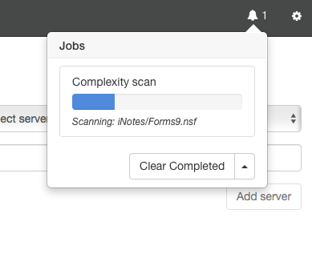
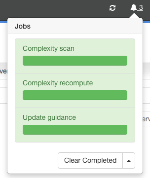

# ジョブ

Adviser は利用状況の取り込みや何百何千という数のデータベースに対するガイダンスの提案を再計算するような長時間起動し続けるタスクを実行することになります。これを Jobs で管理しています。ひとつのジョブはワークステーションまたはサーバー上でバックグランドで実行しているタスクです。Jobs の UI でそれぞれのジョブの進捗状況を追跡でき、ステータスバーのベルマークでアクセスできます。またジョブが実行している場合、ステータスバー配下のステータスバーで確認できます。

## アクティブなジョブを表示
ジョブがアクティブになっている場合、ベルアイコンのとなりにジョブのカウントが表示されます。詳細を見るには、ベルアイコンをクリックしてジョブウィンドウを表示します。

<figure markdown="1">
  
</figure>

上記の例では複雑さスキャンのジョブがひとつ実行されています。 

ベルアイコンを再度クリックしてウィンドウを隠すことができます。このような表示および非表示は実行しているジョブに対して影響を与えることはありません。

## ジョブのクリア
ジョブが完了すると、緑色の背景でそのジョブが表示されます。
<figure markdown="1">
  
</figure>
「ジョブ」ウィンドウの下にある「完了済みをクリア」ボタンをクリックして完了したジョブを削除できます。ボタンの矢印でまた完了していないジョブを残し、すべてのジョブをクリアするメニューを表示できます。通常の操作ではこれは必要ありません。

## データのリロード
ジョブによって現在表示しているデータに変更が加えられることがあります。最後のジョブが完了した際に、次のダイアログが表示されます:
<figure markdown="1">
  
</figure>
「無視」を選択すると現在の画面はリフレッシュされません。データの一覧を確認している途中で、内容の更新前の状態で確認作業を継続したい場合には便利です。「リロード」を選択すると、現在のページがリフレッシュされます。更新を「無視」した場合にはリフレッシュのマーカー  がステータスバーに追加され、これをクリックすることで用意ができた時点でいつでも更新できます。*Remember my choice and do not prompt again* チェックボックスにチェックを入れると今回の指定を記憶し次回からこのダイアログが表示しないようにできます。チェックを入れて「無視」を選択すると、Adviser は最後のジョブが完了すると自動でリフレッシュのマーカーを表示することになります。チェックを入れて、「更新」を選択すれば Adviser は最後のジョブの完了後自動でリフレッシュを行います。

歯車アイコンで設定ページからこのチェックボックスの設定をリセットできます。スキャン・カテゴリを選択しこのチェックボックスの設定を変更したり、ダイアログを表示するように元に戻すこともできます。
<figure markdown="1">
  
</figure>
