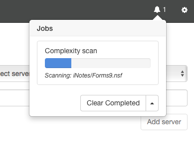
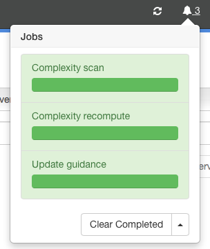
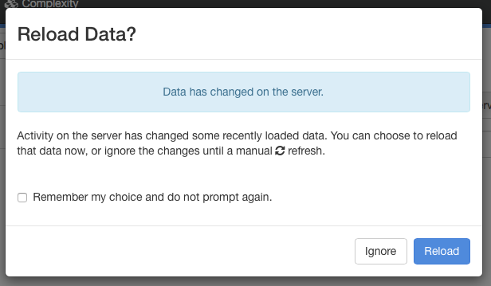
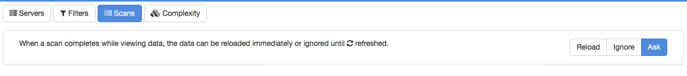

# Jobs

Adviser often has to perform long-running tasks such as importing usage data or recalculating guidance recommendations for hundreds or even thousands of databases. This is managed by the use of *Jobs*. A job is a task that runs either on the workstation or in the background on the server. You can track the progress of jobs from the Jobs UI, accessible from the bell icon in the status bar. When jobs are running, you will also see a progress bar under the status bar.

## Viewing Active Jobs
When jobs are active, you will see a job count next to the bell icon. To view details, click on the bell icon to display the jobs window.

<figure markdown="1">
  
</figure>

In the example above, there is a single Complexity Scan job running. 

Clicking the bell icon again will dismiss the window. Showing or hiding the window does not affect the status of running jobs.

## Clearing Jobs
When a job has completed, it is displayed with a green background.
<figure markdown="1">
  
</figure>
You can remove all completed jobs by clicking the *Clear Completed* button at the bottom of jobs windows. The arrow on the button displays a menu allowing you to clear all jobs, not just those that are complete. This should not be necessary in regular operation, and we recommend talking to tech support before using this feature.

## Reloading Data
A job may make changes to the data that you are currently viewing. When the last job completes, you will see this dialog.
<figure markdown="1">
  
</figure>
If you choose *Ignore*, the current screen will not be refreshed. This is useful if you are partway through reviewing a list of data and do not want it to be updated just yet. If you choose *Reload*, the current page will be refreshed. If you do ignore the update, a refresh marker  will be added to the status bar that you can click to perform the refresh when you are ready. You can use the *Remember my choice and do not prompt again* checkbox to prevent this dialog being displayed in the future. If this box is checked and you choose *Ignore*, Adviser will automatically display the refresh marker when the last job completes. If this box is checked and you choose *Refresh*, Adviser will automatically refresh the page when the last job completes.

You can reset the checkbox setting from the settings page, accessed via the gear icon. Selecting the *Scans* category from the settings page allows you to change the checkbox setting or revert to displaying the dialog.
<figure markdown="1">
  
</figure>
