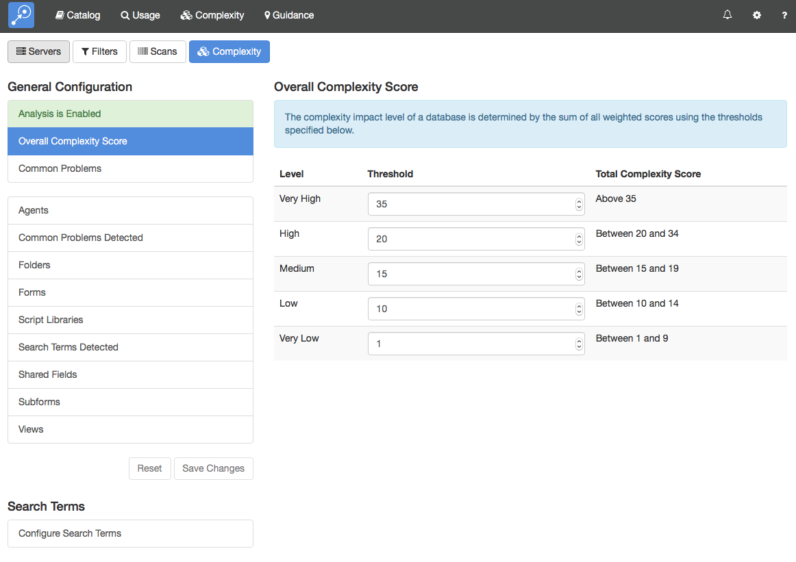
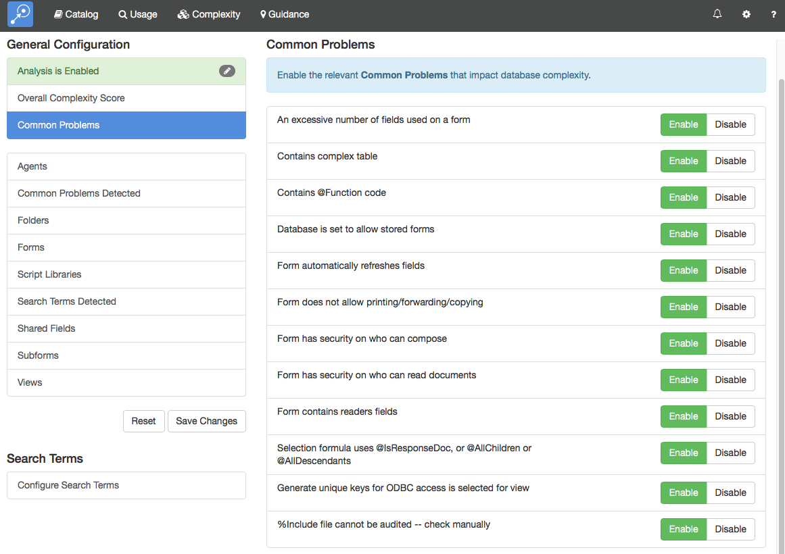
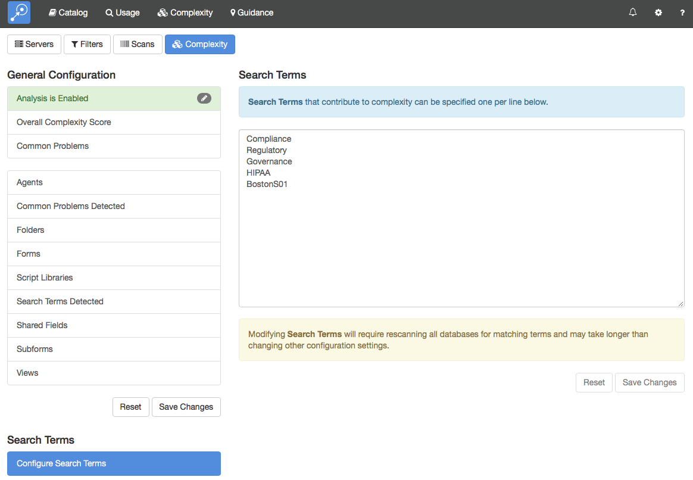

# Complexity

The *Complexity* section allows you to make detailed changes to the way Adviser computes Complexity scores. In general, you will use this page to enable complexity scanning and to configure your search terms. It is rarely necessary to make any further changes and we recommend speaking to tech support before any reconfiguration.

<figure markdown="1">
  
</figure>

## General Configuration
This section allows you to enable/disable Complexity scanning and configure score thresholds and common problems. Any changes that you make in this section will be marked with a pencil icon and must be saved to take effect.

### Enable Complexity
The first option will say either *Analysis is Enabled* or *Analysis is Disabled*. To change the option, click on it and then click the *Save* button. If you do not want to save your changes, the *Reset* button will restore the previous value.

### Overall Complexity Score
This allows you to change the thresholds that define the complexity rankings.

### Common Problems
This section allows you to choose which common problems will contribute to the complexity score. They are all enabled by default.

<figure markdown="1">
  
</figure>

### Agents, ..., Views
These sections allow you to configure the impact different complexity factors have on the overall score. It is rarely necessary to change these.

## Search Terms
This section allows you to configure the keywords that Complexity will search for as it analyzes each database. The search is performed by converting each design element to DXL and then performing a simple text search on the DXL file.

!!! note
    Modifying the list of search terms causes Adviser to rerun the Complexity scan on all databases in your environment which may take several hours or more. We recommend disabling Complexity while you develop your list of search terms and only enabling Complexity once the list is complete.
    
<figure markdown="1">
  
</figure>
