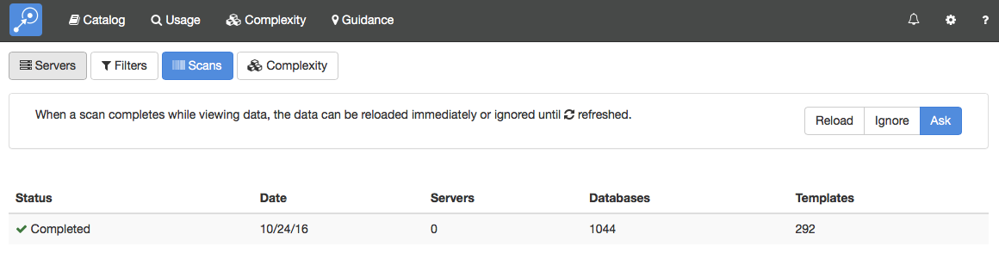

# Scans

The Scans section shows you a history of recent scans and allows you to manage the refresh behavior when background jobs complete. 

<figure markdown="1">
  
</figure>

See [Jobs](jobs.md) for more details on background jobs.