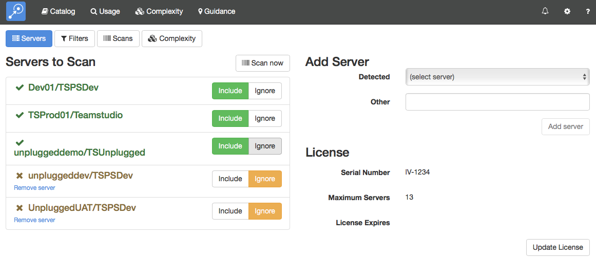

# サーバー

このサーバー設定ページで Adviser がスキャン対象のサーバー群を構成し、スキャンを実行できるようにします。また、このページではライセンスを管理できます。

<figure markdown="1">
  
</figure>

## スキャン対象のサーバー
このセクションには Adviser が検知したサーバーの一覧を表示します。それぞれのサーバーに対してスキャンを実行するかどうかを指定できます。ライセンスで指定されたサーバーの最大数以上のサーバーをスキャン対象に含むことはできません。

!!! note
    Adviser が収集したデータはいつでも表示することができます。もしあるサーバーを無視に設定した場合、以降スキャンは行われませんが既に存在するデータに関しては確認することができます。単純に、ライセンスが期限切れになった時には以降スキャンは行われませんが、それまでの既存データについては表示することができます。
    
## サーバーの追加
Adviser が常に環境内のすべてのサーバーを検知するわけではありません。その場合には、マニュアルで新規にサーバーを追加できます。

## ライセンス
このセクションではシリアル番号とサブスクリプションの期限、スキャン可能なサーバーの最大数を表示します。
