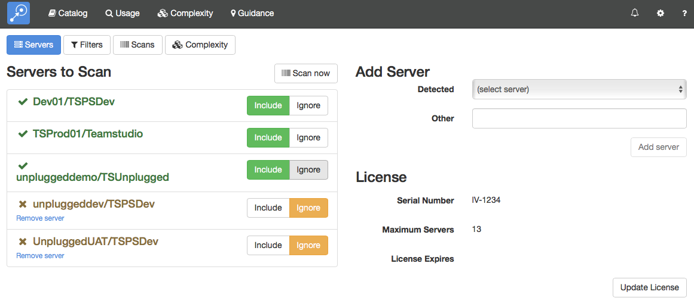

# Servers

The *Servers* settings page lets you configure which servers Adviser should scan and allows you to initiate a scan. This is also the page where you can manage your license.

<figure markdown="1">
  
</figure>

## Servers to Scan
This section shows the list of servers that Adviser has detected in your environment. For each server, you can specify whether it should be scanned. Note that you cannot include more servers than the maximum number of servers specified in your license.

!!! note
    You can always view any data that Adviser has collected. If you ignore a server, it will no longer be scanned but you will still be able to see any existing data. Similarly, if your license expires then no further scans will run but you will be able to view existing data.
    
## Add Server
Adviser may not always be able to detect every server in your environment. In this case, you can add a new server manually.

## License
This section displays your serial number (required for technical support) and the expiration date for your subscription along with the maximum number of servers that may be scanned.
