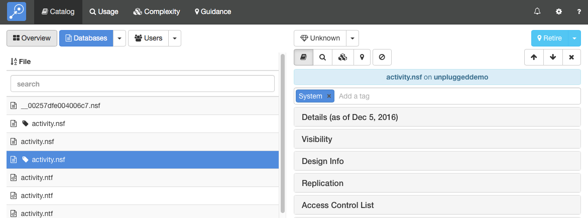

# タグ

タグを使用すると、データベースとユーザーの任意のカテゴリを作成できます。データベースまたはユーザーに必要な数のタグを追加することができ、Adviser のすべてのモジュールでこのタグでグループ化されたデータを表示します。 タグには次のような用途があります。

* ガイダンスの提案を修正する。 データベースのタグを例えば、Salesforce や Zendesk などの特定の製品を指定して追加できます。
* 複数のデータベースをひとつのロジカルなアプリケーション群としてまとめることができます。
* ユーザーを現存するアドレス帳に定義してあるグループとは異なるグループとしてまとめることができます。

## タグの追加と編集
どのモジュールからでもタグを追加したり編集したりできます。下の画面では「カタログ」モジュール内であるデータベースを指定しテンプレートいます。

<figure markdown="1">
  
</figure>

タグは画面右の詳細セクションのリストの上部に表示されます。上の例では、このデータベースには *system* と *domino only* のタグがアサインされています。 さらにタグを追加するには、タグを追加のエリアをクリックして、希望するタグの値を入力してください。Adviser は入力していくにつれて合致するタグの候補を表示します。タグを削除するには、タブ名の×印をクリックするか削除キーで削除します。

## タグの表示
Adviser がユーザーやデータベースのリストを表示する際、上記の例のようにタグの記号で判別できるようしています。 この記号の上にマウスを位置づけるとどのタグが指定されているか分かるようになっています。

すべてのモジュールにあるデータベースとユーザーのリストはタグでグループ化するオプションを備えています。ひとつのデータベースまたはユーザーに複数のタグが指定されていれば必然的に、他のいくつかのグループにも表示されることになります