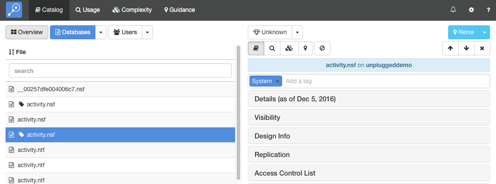

# Tags

Tags allow you to create arbitrary categorizations for your databases and users. You can add as many tags as you need to a database or user and all of the modules in Adviser can display their data grouped by tag. Some uses for tags include

* Refining guidance recommendations. For example, you can add tags for databases that will be replaced with specific products such as Salesforce or Zendesk.
* Collecting together multiple databases that comprise a single logical application.
* Grouping users in ways not captured by existing address book groups.

## Adding and Editing Tags
You can add and edit tags from any module. In the screen below, we have selected a database in the Catalog module.

<figure markdown="1">
  
</figure>

Tags are displayed above the list of detail sections on the right of the screen. In the example above, the database has already been assigned the System tag. To add another tag, simply click on *Add a tag* and type the new tag value. Adviser will suggest matching tags as you type. To remove a tag, simply click on the x by the tag name or use the delete key.

## Viewing Tags
Whenever Adviser displays a list of users or databases, it will mark any that are tagged with a tag symbol, as shown above. You can hover over the symbol to view the tag or tags.

The database and user lists in all modules have the option to group by tag. A database or user will be listed in more than one group if it has multiple tags.