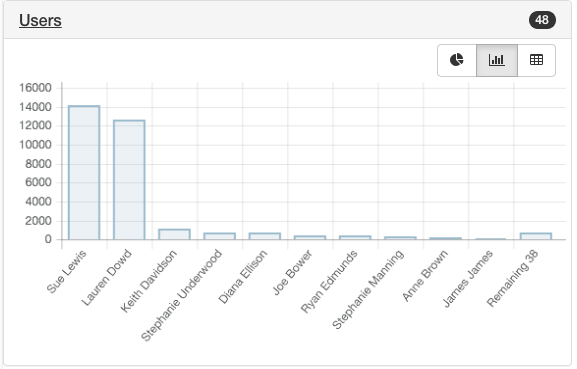
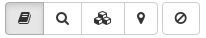
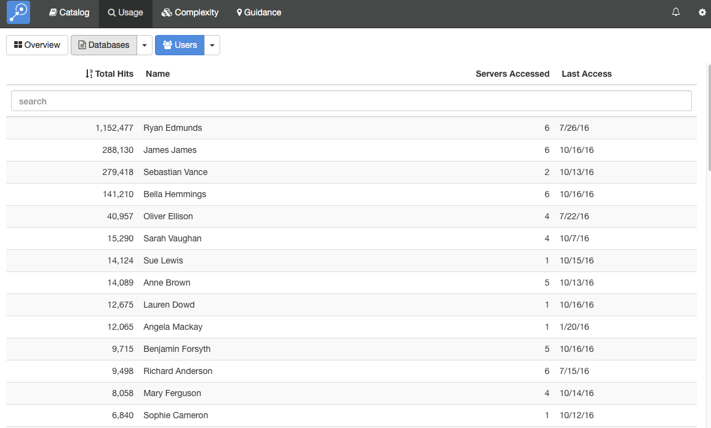

# 利用状況

「利用状況」モジュールは Domino のログファイルに保存されている利用状況の詳細情報を収集します。これによって、データベースがどの程度使用されているかの情報やどのユーザーがデータベースを使用しているかの情報を確認できます。また、Web での利用やクライアントからの利用を区別すると同時に個々のユーザーからの利用かエージェントやサーバーからのアクセスかをしっかりと区別します。

## 利用状況スキャンの実行
Domino サーバーは 14日間の利用情報を保存しているだけであるため、データが破棄されるまでにデータを定期的にスキャンすることが重要になってきます。インストールのセクションでは Teamstudio Adviser が毎晩利用状況のスキャンを実行するに必要な設定の方法を説明していますのでご参照ください

## 利用状況データの表示
利用状況データを表示するには、上部ナビゲーションバーの *「利用状況」*を選択するか、Adviser ホームページの「利用状況」セクションをクリックします。これで、利用状況の概要ページが表示されます。
<figure markdown="1">
  
</figure>
こちらは、利用が多いデータベースともっとアクティブなユーザーを表示しています。それぞれのチャートの隣にあるボタンを使って、パイチャート、棒グラフ、表へと切り替えることができます。スキャン履歴を使ってそれぞれのサーバーに対してスキャンが成功しているかも確認できます。

## データベース利用状況の表示
データベースの一覧を表示するには画面上部の「データベース」ボタンをクリックします。 
<figure markdown="1">
  
</figure>
デフォルトでは、すべてのサーバー上の全データベースの一覧を表示します。Teamstudio Adviser 内のどのリストにも共通して、列ヘッダーをクリックすることでデータをソートできます。また、検索ボックスを使って検索テキストに合致したデータベースを表示できます。すべての列が検索され、例えばテンプレート名だけでなくデータベースパスも検索対象となります。

表内のカウントは次をとおりです:
| 列名 | 説明 |
|---|---|
| ユーザー合計 | ユーザーによってデータベースに対してヒット数の総合計で、たとえばこのヒット数にはサーバーやエージェントによるヒットは除外されています。*Notes* と *Web* 列の合計です。 |
| Notes | Notes クライアントからデータベースを使用した回数です。この値はセッションの回数が記録され、ユーザーがデータベースを開いた時や Notes から開いたり閉じたりしたときに、それぞれ単一のセッションとしてカウントされるものです。|
| Web | HTTP 経由でユーザーがデータベースにアクセスした回数です。HTTP にはセッションというコンセプトがないため、データベースにアクセスした個々の回数になります。例えばある文書を表示するためページを開くと、データベース内にあるイメージリソースとして保存されているグラフを取得したりと複数のデータベースアクセスとしてカウントされます。そのため、この列のカウントは Notes 列のカウントより著しく大きな値になるかもしれません。|
| 日数 | すくなくともひとりのユーザーでデータベースがアクセスされたユニークな日数です。同様にサーバーとエージェントのアクセスは除外されています。|
| ユーザー | そのデータベースにアクセスしたユニークなユーザー数です。|

完全なリストを表示する代わりに、いろんな方法でデータベースをグループ分けできます。画面上部の Databases ボタンの右にある下矢印をクリックします。テンプレート別、最終更新日別などのデータをグループ化できる方法を提供しています。例えば、テンプレートでグループ分けしたい場合、下のような画面が表示されます。
<figure markdown="1">
  
</figure>
左側にテンプレートのリストが表示され、そのテンプレートが使用されていますデータベースの数も確認できます。テンプレートを選択すると、該当するデータベースが表示されます。

## レプリカ ID によるグループ化
利用状況ビュー内のデータベースをレプリカ ID でグループ化できます。これによって、複数サーバー間で複製されているデータベースのより分かりやすい情報を収集できます。:
<figure markdown="1">
  
</figure>
このオプションが有効なとき、サーバー列はデータベースが検知されたサーバーの数とレプリカに対する利用状況の合計値が表示されます。ファイル名とタイトルが、すべてのレプリカで一致していない場合、レプリカの数を表示するようにしています。この行をクリックすると展開し個々のレプリカの統計情報を確認できます。

## データベースの利用状況詳細を表示する
ひとつのデータベースに対して、利用状況の詳細を表示するには、単純にリストからそのデータベースを選択します。これで、詳細画面が表示されます。
<figure markdown="1">
  
</figure>
この画面では、左にデータベースのリストを表示し、右に選択データベースの詳細を表示します。そのデータベースに関する異なるタイプのデータを展開し表示することができます。Teamstudio Adviser はどのセクションを展開したかを記憶しているので、アプリケーション間を移動しても同じセクションの状態で詳細を表示します。

### 使用カウント
この 使用カウントセクションでは、上図に示すとおり、表形式でそれぞれの回数を表示します。加えて、エージェントやサーバーによるデータベースアクセスの回数も表示しています。

### ユーザー
このユーザーセクションでは、データベースにアクセスしたユーザーを表示します。上のスクリーンショットにみる 10 という数字は、データベースにアクセスしたユニークなユーザーの数を表します。
<figure markdown="1">
  
</figure>

### エージェント
このエージェントセクションでは、データベースにアクセスエージェントを表示します。スクリーンショットにある回数 0 は、データベースにアクセスしたユニークなエージェントの数を表示します。
<figure markdown="1">
  
</figure>

### トレンド
このトレンドセクションでは、ユーザーが Notes または Web からデータベースにアクセスした回数を月ごとに表示しています。このカウントはサーバーやエージェントによるアクセスは除外されています。
<figure markdown="1">
  
</figure>

詳細情報上部のボタン群列を使って他のモジュールが収集した詳細情報を確認できます:
<figure markdown="1">
  
</figure>
 
このボタンで「カタログ」、「利用状況」、「複雑さ」、「ガイダンス」の各詳細に切り替わります。最後のボタンはデータベースをフィルターするのに使用されます。詳しくは[Filters](filters.md)をご参照ください。

表示していたものグループ分けされていたリストであった場合は、スクリーンの上部左側に追加のコントールが表示され、グループ間を切り替えルことできます。このボタンには左矢印と右矢印のコントロールがあり、前や次のグループに移動できます。そのグループ名のある中央のテキストをクリックして、グループすべてを表示してドロップダウンリストから選択することもできます。

### キーボード操作
詳細ビューの操作を容易にするいくつかのキーボードショートカットを用意しています。

* 上または下矢印でリスト内のデータベースを前や次に移動できます
* 左または右矢印で、異なるモジュールへ切り替えることができます

## ユーザー利用状況の表示
ユーザーの一覧を表示するには、画面上部の「ユーザー」ボタンをクリックします。
<figure markdown="1">
  
</figure>

デフォルトでは、すべてのサーバー上の全データベースの一覧を表示します。Teamstudio Adviser 内のどのリストにも共通して、列ヘッダーをクリックすることでデータをソートできます。また、検索ボックスを使って検索テキストに合致したデータベースを表示できます。すべての列が検索され、例えばテンプレート名だけでなくデータベースパスも検索対象となります。

表内のカウントは以下のとおりです:
| 列名 | 説明 |
|---|---|
| 合計ヒット数 | このユーザーで記録されたデータベースアクセスの総合計。このカウントの計算方法は上記の Database セクションを参照してください。|
| アクセスしたサーバー | このユーザーで各サーバーにアクセスした回数。|
| 最終アクセス | このユーザーのアクティビティを検知した最終日。|

完全なリストを表示する代わりに、いろんな方法でデータベースをグループ分けできます。画面上部の「データベース」ボタンの右にある下矢印をクリックします。テンプレート別、最終更新日別などのデータをグループ化できる方法を提供しています。例えば、テンプレートでグループ分けしたい場合、下のような画面が表示されます。
<figure markdown="1">
  
</figure>

## ユーザー利用状況詳細の表示
あるデータベースの利用状況の詳細を表示するには、単純にリストからそのデータベースを選択します。これで、詳細画面が表示されます。
<figure markdown="1">
  
</figure>
この画面では、左にデータベースのリストを表示し、右に選択データベースの詳細を表示します。そのデータベースに関する異なるタイプのデータを展開し表示することができます。Teamstudio Adviser はどのセクションを展開したかを記憶しているので、アプリケーション間を移動しても同じセクションの状態で詳細を表示します。

### ユーザー詳細
このユーザー詳細セクションでは、上で示すとおり、リスト内にある同じサマリー情報を表示しています。

### データベース
このデータベースセクションでは、このユーザーがどのデータベースにアクセスしたかを表示します。上のスクリーンショットにあるカウント 646 はこのユーザーがアクセスしたユニークなデータベースの数を表します。
<figure markdown="1">
  
</figure>

### サーバー
このサーバーセクションでは、このユーザーのサーバーアクセスを表示します。上にスクリーンショットにあるカウント 1 は、このユーザーがアクセスしたユニークなサーバーの数を表しています。
<figure markdown="1">
  
</figure>

### キーボード操作
上または下矢印でリスト内のデータベースを前や次に移動できます