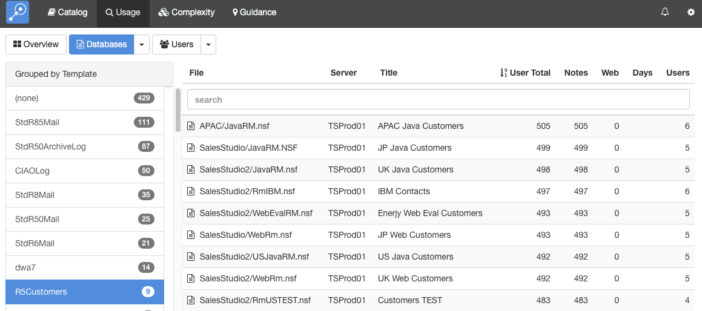
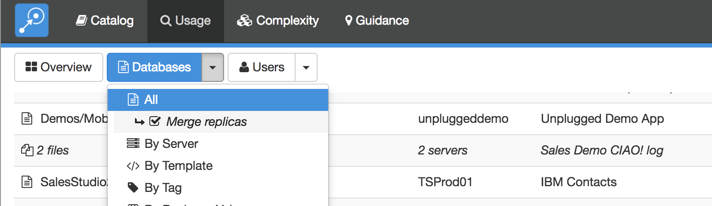
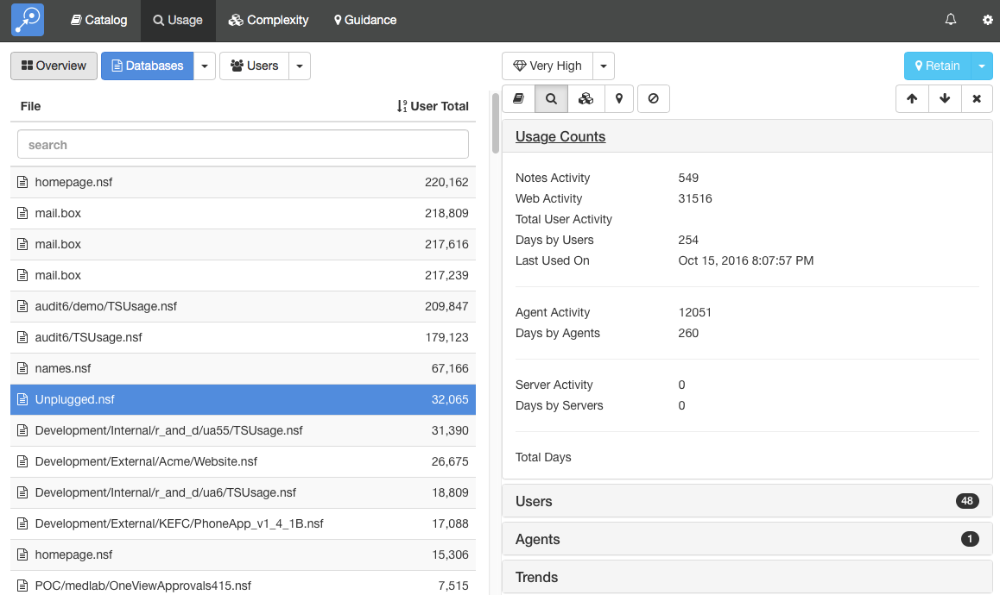
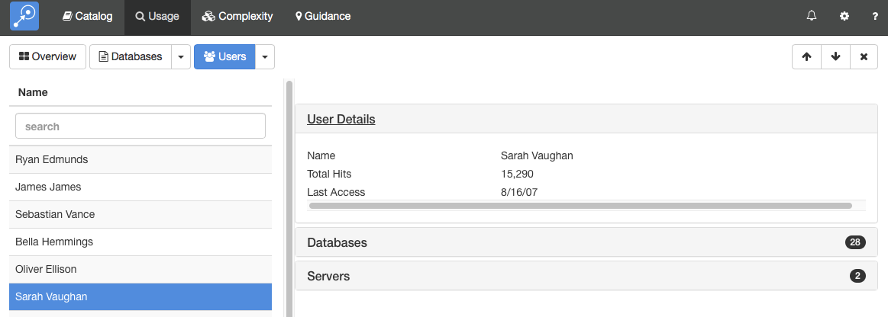

# Usage

The Usage module collects detailed usage information stored in the Domino log file. It allows you to view information about how much your databases are being used and who is using them. It distinguishes between web and client usage and also separates usage by individual users from usage by agents or servers.

## Running Usage Scan
The Domino server only retains usage information for fourteen days so it is important that you run usage scans regularly to import the data before it is lost. The installation section explains how to configure Teamstudio Adviser to run a usage scan every night.

## Viewing Usage Data
To view usage data, select *Usage* from the top navigation bar or click on the Usage section of the Adviser home page. This will display the Usage overview page.
<figure markdown="1">
  
</figure>
This shows the databases with the most usage and the most active users, along with the last few scans. You can use the buttons next to each chart to view the data as a pie chart, a bar chart or a table. You can use the scan history to verify that your servers are being scanned successfully.

## Viewing Database Usage
To view a list of databases, click the *Databases* button at the top of the screen. 
<figure markdown="1">
  
</figure>
By default, this will display a list of all of the databases on all your servers. As with any list in Teamstudio Adviser, you can click on any of the column headers to sort the data. You can also use the search box to limit the display to databases matching the search text. All of the columns are searched, so you can, for example, match on a database title, not just a database path.

The counts in the table are defined as follows.
| Column Name | Description |
|---|---|
| User Total | The total number of hits for the database by users i.e. excluding hits from servers and agents. This is the sum of the *Notes* and *Web* columns. |
| Notes | The number of times the database was used by users from a Notes client. This is a count of *sessions*: when a user opens a database, interacts with it from the Notes client and then closes it, that counts as a single session. |
| Web | The number of times the database was accessed by users via HTTP. Since HTTP does not have a concept of sessions, this is a count of individual database accesses. For example, opening a page to view a single document might involve several database accesses to retrieve graphics stored as image resources in the database. Therefore the counts in this column tend to be significantly larger than the counts in the *Notes* column. |
| Days | The number of unique days on which the database was accessed by at least one user. Again, server and agent hits are excluded. |
| Users | The number of unique users who accessed the database. |

Instead of viewing a complete list, you can group the databases in various ways. To do this, click on the down arrow at the right of the *Databases* button at the top of the screen. This will offer several ways to group the data, such as by template or by server. For example, if you group by template, you will see a screen like the following.
<figure markdown="1">
  
</figure>
To the left, a list of templates is shown, along with how many databases use that template. Selecting a template will display a list of those databases.

## Grouping by Replica ID
Databases in Usage views can also be grouped by Replica ID, to give a clearer picture of database usage across multiple replicating servers.
<figure markdown="1">
  
</figure>
When this option is enabled, the server column will display the number of servers the database was found on, and the row will show combined usage totals for all replicas. The file name and title, if not identical on all replicas, will also show the number of replicas. Clicking on this row will expand it so that statistics for individual replicas can be viewed.

## Viewing Database Usage Details
To view the usage details for a database, simply select the database from any list. This will display the details screen.
<figure markdown="1">
  
</figure>
This screen shows the database list on the left and the details of the selected database on the right. You can expand the sections to view different types of data about the database. Teamstudio Adviser will remember which section you have expanded so that you will see a consistent view as you navigate through the application.

### Usage Counts
The *Usage Counts* section, shown above, shows the counts available from the table along with additional counts for database accesses by agents and by servers.

### Users
The *Users* section shows which users have accessed the database. The count, 48 in the screenshot, shows how many different users have accessed the database.
<figure markdown="1">
  
</figure>

### Agents
The *Agents* section shows which agents have accessed the database. The count, 1 in the screenshot, shows how many different agents have accessed the database.
<figure markdown="1">
  
</figure>

### Trends
The Trends section shows historical monthly counts for notes and web database access by users. As usual, server and agent accesses are excluded from these counts.
<figure markdown="1">
  
</figure>

You can view details from other modules using the row of buttons above the details.
<figure markdown="1">
  
</figure>
 
These will switch between Catalog, Usage, Complexity and Guidance details. The last button is used to filter the database - see [Filters](filters.md) for details.

If the list that you were viewing was grouped then you will see an additional control at the top left of the screen that allows you to navigate through the groups. This control has buttons with left and right arrows that allow you to navigate to the previous and next groups. You can also click on the central text with the group name to select from a dropdown list of all groups.

### Keyboard Navigation
There are several keyboard shortcuts to help you navigate around the details view.

* Up and Down arrows will move to the previous and next databases in the list.
* Left and Right arrows will cycle through the different modules.

## Viewing User Usage
To view a list of users, click the *Users* button at the top of the screen.
<figure markdown="1">
  
</figure>

By default, this will display a list of all of the users with any recorded database access. As with any list in Teamstudio Adviser, you can click on any of the column headers to sort the data. You can also use the search box to limit the display to users matching the search text.

The counts in the table are defined as follows.
| Column Name | Description |
|---|---|
| Total Hits | The total number of database accesses recorded for this user. See the database section above for details on how these this count is computed. |
| Servers Accessed | The number of different servers accessed by this user. |
| Last Access | The last day on which activity was found for this user. |

Instead of viewing a complete list, you can group the users in various ways. To do this, click on the down arrow at the right of the Databases button at the top of the screen. This will offer several ways to group the data, such as by data of last access. For example, if you group by template, you will see a screen like the following.
<figure markdown="1">
  
</figure>

## Viewing Usage Usage Details
To view the usage details for a user, simply select the user from any list. This will display the details screen.
<figure markdown="1">
  
</figure>
This screen shows the user list on the left and the details of the selected user on the right. You can expand the sections to view different types of data about the user. Teamstudio Adviser will remember which section you have expanded so that you will see a consistent view as you navigate through the application.

### User Details
The *User Details* section, shown above, shows the same summary information available in the list.

### Databases
The *Databases* section shows which databases the user has accessed. The count, 28 in the screenshot, shows how many different databases the user has accessed.
<figure markdown="1">
  
</figure>

### Servers
The *Servers* section shows which servers the user has accessed. The count, 2 in the screenshot, shows how many different servers the user has accessed.
<figure markdown="1">
  
</figure>

### Keyboard Navigation
You can use the up and down arrows to move the previous and next users in the list.